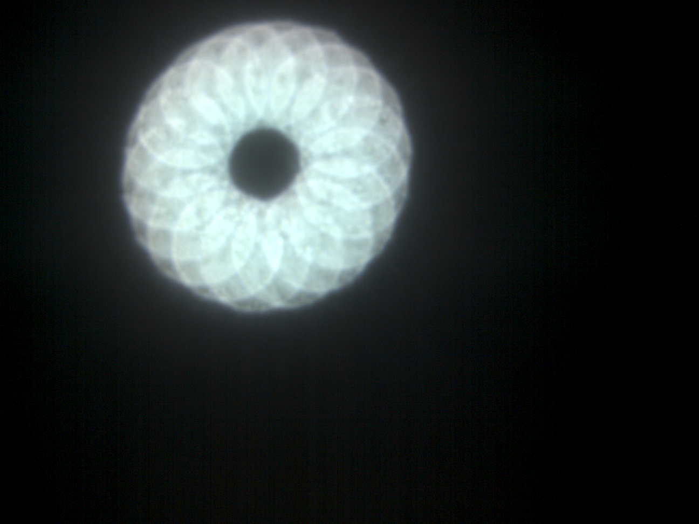
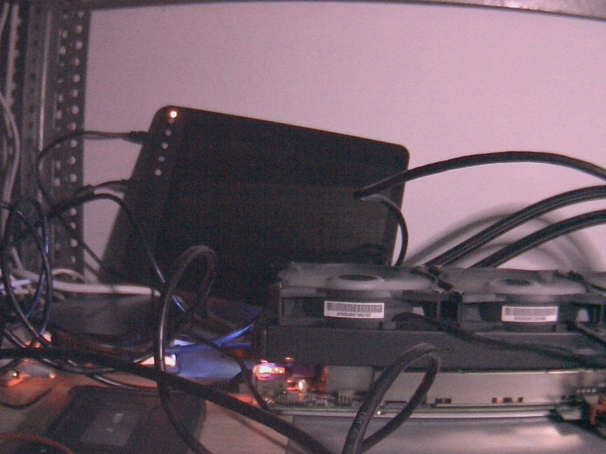

# OV5647 (Raspberry Pi Camera v1) driver for NVIDIA Jetson

ISP-integrated driver for the OmniVision OV5647 sensor (Raspberry Pi
Camera Module v1) on NVIDIA Jetson boards. One driver source builds on
L4T R32, R35 and JetPack 7 (kernels 4.9, 5.10, 6.8); the installer
detects the board. The sensor reaches the NVIDIA camera stack, not
just raw frames: hardware ISP (AE, AWB, debayer) via
`nvarguscamerasrc` and zero-copy NVMM buffers in every mode, plus
plain V4L2 raw Bayer capture in all of them.

First light, raw path: a 2592x1944 Bayer frame captured through the
driver with V4L2, then debayered in software (2x2 Bayer quads to one
pixel each, hence the half-resolution image):

The same sensor through the full hardware pipeline at 1296x972: ISP
debayer, auto exposure and white balance, JPEG-encoded on the Jetson.
Colors are not tuned yet (see Known limitations), which is why the
image pulls magenta:

## Why this exists

The Pi Camera v1 carries the OV5647. Jetson's stock JetPack ships
drivers for the IMX219 (Pi Camera v2) and IMX477 (HQ), not for this
sensor, so the camera and the board do not work together out of the
box on any L4T release.

There is no maintained open-source answer. RidgeRun sells a closed
driver, last documented for L4T 32.1. A 2019 alpha by jas-hacks
shipped prebuilt binaries for L4T 32.2 and was never maintained. The
rest are unmaintained, incomplete, or stop at raw V4L2 capture
without ISP integration. The ISP is the part worth having: hardware
debayer, auto exposure, auto white balance, and DMA straight into
NVMM buffers that CUDA and the encoders consume without a copy. The
survey, with what each project did and did not do, is in
[docs/prior-art.md](docs/prior-art.md).

## Support matrix

| Board | L4T | Status |
|---|---|---|
| Jetson Nano 2GB (P3448-0003) | R32.7.6 / JetPack 4.6.6 | working, verified on hardware |
| Jetson Nano 4GB (P3448-0000) | R32.7.x | untested, overlay symbols need checking |
| Jetson Xavier NX devkit (P3668) | R35.x / JetPack 5 | working, verified on hardware |
| Jetson Orin Nano/NX devkit (P3767) | JetPack 7 / L4T r39 | installer runs, board boots the merged DTB and the sensor node comes up on I2C; with no camera attached the probe stops at the chip-ID read |

## Status

- [x] Chip detection over I2C (addr 0x36, ID 0x5647)
- [x] tegracam probe and bind on hardware
- [x] Modes: 2592x1944, 1920x1080, 1296x972, 640x480
      (nominal 15, 30, 30, 62 fps; see Known limitations for the
      exact rates the timings produce)
- [x] Raw V4L2 Bayer capture, all four modes
- [x] Module identity from the sensor's OTP memory, as `otp_data`
- [x] Hardware ISP via `nvarguscamerasrc`, all four modes; a
      900-frame 1080p run reports no dropped buffers
- [x] Builds on R32 (4.9), R35 (5.10), JetPack 7 / r39 (6.8); each
      board boots its merged DTB and probes the sensor node. The 4.9
      and 5.10 boards are verified with a camera attached; on the 6.8
      board the probe stops at the I2C read, for want of a camera.
- [x] Camera-attached test on Xavier NX: all four modes raw and
      through the ISP, same driver and overlay as committed
- [ ] Camera-attached test on Orin (needs a 15-to-22-pin adapter ribbon)
- [ ] ISP color tuning file (camera_overrides.isp)
- [ ] Prebuilt release artifacts (.ko, .dtbo, installer)

## How the capture path works

The Pi Camera v1 is a 5 MP rolling-shutter sensor speaking 2-lane MIPI
CSI-2, 10-bit Bayer (BGGR). The module carries its own 25 MHz
oscillator and gates its power regulators with the ribbon's enable pin,
so the driver needs no clock or regulator plumbing, only one GPIO:
until that pin is high the sensor does not even ACK on I2C.

On the Jetson side the frame takes this path:

    OV5647 --2-lane CSI--> NVCSI --> VI --DMA--> system memory --> /dev/video0

NVCSI is the CSI-2 receiver brick, VI (video input) DMA-writes the
raw Bayer frames to memory. That is the V4L2 path: the pixels are the
sensor's own, with no debayer or correction applied, though VI pads
each line to a 64-byte boundary on the way out (see Bring-up notes).

The interesting path goes through the ISP instead:

    OV5647 --> NVCSI --> VI --> ISP (debayer, AE, AWB) --> NVMM buffers

`nvargus-daemon` owns that pipeline. It runs the exposure and white
balance loops by calling the same driver controls a V4L2 user would
(gain, exposure, frame rate), and hands out finished RGB/YUV frames in
NVMM buffers that `nvarguscamerasrc`, the hardware encoders and CUDA
consume zero-copy.

The driver itself is a tegracam driver. tegracam is NVIDIA's kernel
framework for camera sensors: the driver supplies a table of modes and
a handful of ops (power on/off, set mode, start/stop streaming, set
gain/exposure/frame rate), and the framework builds the V4L2 subdevice,
the media controller graph and the control plumbing around it. The
mode list lives twice by design: register tables in the driver, timing
properties in the device tree, and the two must agree (see Bring-up
notes).

What it looks like on a running Nano:

    $ dmesg | grep ov5647
    [    3.908647] ov5647 6-0036: tegracam sensor driver:ov5647_v2.0.6
    [    3.939281] ov5647 6-0036: OV5647 detected (chip id 0x5647)
    [    3.939355] vi 54080000.vi: subdev ov5647 6-0036 bound
    [    3.940301] ov5647 6-0036: detected ov5647 sensor

    $ media-ctl -p -d /dev/media0
    - entity 1: nvcsi--1 (2 pads, 2 links)
                type V4L2 subdev subtype Unknown flags 0
                device node name /dev/v4l-subdev0
        pad0: Sink
            <- "ov5647 6-0036":0 [ENABLED]
        pad1: Source
            -> "vi-output, ov5647 6-0036":0 [ENABLED]

    - entity 4: ov5647 6-0036 (1 pad, 1 link)
                type V4L2 subdev subtype Sensor flags 0
                device node name /dev/v4l-subdev1
        pad0: Source
            [fmt:SBGGR10_1X10/2592x1944 field:none colorspace:srgb]
            -> "nvcsi--1":0 [ENABLED]

    - entity 6: vi-output, ov5647 6-0036 (1 pad, 1 link)
                type Node subtype V4L flags 0
                device node name /dev/video0
        pad0: Sink
            <- "nvcsi--1":1 [ENABLED]

## The device tree overlays

Nothing in this project reflashes a board. Each board gets a device
tree overlay, merged with `fdtoverlay` into a new DTB that is selected
with one `FDT` line in `extlinux.conf`. The stock DTBs stay untouched
and the installer keeps a copy of the base it merged, so re-running it
never stacks the overlay on top of itself. Reverting means restoring
the backed-up `extlinux.conf` and deleting what the installer wrote:
the module and its files under `/boot`. The installer prints the exact
commands.

Where the base DTB comes from differs by board. On Nano and Xavier NX
it is a file in `/boot`, named by `extlinux.conf` when the board
already has an `FDT` line. JetPack 7 hands the DTB over from UEFI and
extlinux names no file, so the first install merges onto
`/sys/firmware/fdt`, the live tree, which is the only copy of it the
running system has; later runs merge onto the snapshot that first
install kept, because by then the live tree is the merged one.

The overlay is where the boards differ, and they fall into two
groups:

- Nano (R32) and Xavier NX (R35) ship DTBs that already contain the
  complete camera graph, wired for the stock IMX219. The overlay swaps
  the sensor: it disables the IMX219 node, adds the OV5647 on the
  camera I2C bus, repoints the NVCSI input endpoint and rebadges the
  `tegra-camera-platform` entry. The sensor node with its four mode
  descriptions is the bulk of the file; the rewiring itself is a
  handful of lines.
- JetPack 7 (Orin) ships a DTB with the SoC blocks present but nothing
  wired: `tegra-capture-vi` and the NVCSI controller carry no ports or
  channels, and there is no sensor, no camera I2C mux and no
  `tegra-camera-platform`. The overlay supplies all of it, extending
  three existing nodes by path (`tegra-capture-vi`, the NVCSI
  controller and the main GPIO node) and adding the rest, with three
  phandle references into the base tree (`&gpio`, `&gpio_aon`,
  `&cam_i2c`). NVIDIA's own IMX219 overlay for this carrier
  declares swapped CSI lane polarity (`lane_polarity = "6"`), so this
  overlay carries it too; that part is inherited rather than measured,
  since no camera has been on this board yet.

Each mode node in the overlay repeats the timing its register table
programs (line length and pixel clock), because the framework computes
exposure and frame-rate register values from the device tree numbers,
not from the driver. Frame length is the exception: it lives only in
the driver, which writes each mode's nominal value in `set_mode`.

### Orientation

A module mounted upside down or facing a mirror is corrected in the
sensor node, with either or both of:

    horizontal-mirror;
    vertical-flip;

They apply to every mode, and the property names follow NVIDIA's
reference sensor drivers. Orientation has to come from the device tree
rather than from `V4L2_CID_HFLIP` and `V4L2_CID_VFLIP`, because the
tegracam control list is fixed and has no entry for a flip.

Flipping an axis reverses the readout order, which moves the Bayer
phase by one pixel and would leave the frames starting on a different
colour than the `bggr` the overlay declares. The driver corrects for
that, so the advertised format stays true in any orientation. The
correction differs per axis, which measurement settled rather than the
datasheet: horizontally the phase follows the width of the read-out
window, so only its left edge moves, while the line length on the wire
comes from the output size register and does not change. Vertically
both edges move, because dropping a line leaves the VI waiting for a
frame that never completes, reported as `MW_ACK_DONE syncpoint time
out` with frames of zeroes.

The image mirrors in both axes on R32 and R35. The Bayer phase was
checked separately, under diffuse light rather than against a screen,
and holds in the full-resolution and binned modes; the other two read
out unbinned and this bench could not light them brightly enough to
judge. Do not use an LCD as the target for that check: an unbinned mode
resolves its subpixel stripes finely enough that mirroring the image
moves the colour onto a different Bayer position, which looks exactly
like a phase the driver failed to correct.

Note that the mode tables read out mirrored already, so the driver
toggles the bits rather than setting them: `horizontal-mirror` means
the opposite of what the tables do, which is the change a user asking
for it wants to see.

### Module identity

Each sensor carries 256 bits of one-time programmable memory, which the
module vendor uses for identification. The driver reads it once at probe
and hands it over as a standard control:

    v4l2-ctl -d /dev/video0 --get-ctrl otp_data

The two Raspberry Pi Camera v1 modules here answer with five populated
bytes apiece, different between them, so the value tells one camera from
another on a bench with several. Modules with blank memory read as
zeroes and the probe carries on regardless.

The read needs the sensor's internal clock, which only runs once it is
out of standby, so the driver briefly enables streaming for it. Powered
but idle, as the sensor is for most of probe, the buffer comes back
empty.

## Install

The camera goes in the CAM0 connector. The overlays wire that port
only, so a camera on CAM1 produces no frames. Orin devkits have 22-pin
connectors and need a 15-to-22-pin adapter ribbon.

On the board:

    git clone https://github.com/akandr/ov5647-jetson && cd ov5647-jetson
    sudo ./install.sh
    sudo reboot

The installer detects the board, installs the packages it builds with
(`device-tree-compiler` and the L4T kernel headers, plus the
out-of-tree headers on JetPack 7), builds the module against the
installed kernel headers, merges the board's overlay onto the DTB that
board boots (see The device tree overlays) and points the extlinux
`FDT` entry of the boot entry `DEFAULT` names at the merged copy. The
original `extlinux.conf` is backed up as `extlinux.conf.orig`, and the
revert commands are printed at the end of a successful run: restore
that backup, delete the module from `/lib/modules/$(uname -r)/updates`
and the files the installer wrote under `/boot`, then `depmod -a` and
reboot.

Then:

    # ISP path, 1080p30 through hardware debayer/AE/AWB
    gst-launch-1.0 nvarguscamerasrc ! 'video/x-raw(memory:NVMM),width=1920,height=1080' ! fakesink

    # raw Bayer path
    v4l2-ctl -d /dev/video0 --set-ctrl=sensor_mode=1 \
             --set-fmt-video=width=1920,height=1080,pixelformat=BG10 \
             --stream-mmap --stream-count=30 --stream-to=frames.raw

The overlay sets `use_sensor_mode_id`, so the mode comes from the
`sensor_mode` control rather than from resolution matching. The
requested format still has to match that mode's resolution: ask for a
size the selected mode does not produce and the driver falls back to
its default mode, silently handing you full-resolution frames.

`tests/capture-check.sh` runs the whole set: every raw mode and the ISP
modes. It checks more than the frame count, because a frame count on
its own proves little here. `v4l2-ctl` keeps streaming in the previous
format when the one you asked for is rejected, so the script confirms
the device really accepted the geometry and that the file holds exactly
the expected number of bytes. It also reports the spread of pixel
values, which is what separates a working sensor from a covered lens:
both deliver full frame counts, only one delivers signal.

`tests/control-check.sh` covers the other half: whether the controls
reach the sensor at all. Frames can arrive with perfect geometry while
exposure, gain and frame rate are ignored, and nothing in a capture test
would notice. It sweeps exposure and gain against the sensor black level,
counts delivered frames to check the requested frame rate, and switches
on the sensor's own bar pattern through the register interface. Exposure
and gain need a lit scene; with a covered lens the script reports those
two as inconclusive rather than failed.

Two properties of the framework decide how any such test has to be
written, and both look like driver bugs when you hit them:

- Controls set before streaming starts do not reach the sensor. The
  default `override_enable=0` tells the framework not to apply stored
  values at stream start, so a sweep done that way produces a perfectly
  flat curve. Either set controls while streaming, as applications do,
  or set `override_enable=1` first.
- Every stream start rewrites the frame length from the mode table, so
  a frame rate set for one stream is gone by the next. Measuring the
  rate therefore only works within a single continuous stream.

## Control ranges in practice

Exposure is limited by the current frame length, not by the maximum the
control advertises. At 30 fps the frame is 1435 lines, so exposure stops
rising at 1427 lines, near 33 ms, whatever value you write; the control
still accepts up to 500 ms. Lower the frame rate first and the full
range becomes reachable: at 4 fps the same driver reaches 10760 lines.
This is the sensor's own constraint rather than a driver limit, but the
advertised maximum does not hint at it.

Raw sample scaling differs between L4T generations, which matters if the
same code reads frames from more than one board. The sensor's bar
pattern comes back as 1023 / 511 / 0 on R32 and as 65535 / 32767 / 0 on
R35: the same 10-bit values, right-aligned on one and expanded to the
full 16-bit range on the other. Normalise by the format rather than
assuming a 10-bit range.

### Prebuilt artifacts

A release carries the source tarball, the three device tree overlays and
one kernel module per L4T line. The overlays are ready to use: the
installer compiles the same thing from `dt/`, so a prebuilt `.dtbo`
merges onto a board's DTB exactly as a locally built one does.

A module is another matter. The kernel loads one only when its vermagic
matches the running kernel exactly, down to the patch level, so the
prebuilt modules fit the releases they were built on and nothing else:

    uname -r                                    # what the board runs
    modinfo -F vermagic ov5647-nano-*.ko        # what the module wants

If those disagree, build from source, which is what `install.sh` does
anyway and why the tarball rather than the binaries is the artifact that
matters. Every release lists the kernel version, L4T release and
vermagic of each module in its manifest.

## Bring-up notes

Things that cost real debugging time, kept here so they cost it only
once:

- T210 (Nano) rejects every frame of this sensor with the mainline
  register tables. The mainline tables program a gated MIPI clock; the
  Nano's VI then counts frames at the right cadence but rejects each
  one with `tegra_channel_error_status: error 20022` and delivers zero
  bytes. The fix is a continuous clock on both sides: `0x4800 = 0x04`
  in every mode table and `discontinuous_clk = "no"` in the DT. The bit
  that matters is 5, the clock lane gate: mainline sets it, so the clock
  lane stops between packets, and these tables clear it so it free-runs.
- These tables came from mainline and have since drifted from it, in
  five places. Two are deliberate: the clock gate above, and 0x0100,
  which stays 0 because streaming is driven from separate start and stop
  tables rather than from the mode table. Two are harmless: these tables
  program the line length in 0x380c and 0x380d where mainline leaves the
  reset default, to the same values it assumes; and they set 0x3821 bit
  2, `r_mirror_isp`, which measurably does nothing here because the
  sensor's own ISP is not in the raw path. The fifth is real: mainline
  unified the PLL across the full, 1080p and binned modes in December
  2025, so upstream now clocks the latter two at 87.5 MHz where these
  tables clock them at 81.67 MHz, and runs them about 7% faster.
- The failure signature tells you where to look. Frames counted but
  rejected: link integrity, check clocking. No frames at all: check
  mode timings and lanes, or (voice of experience) the ribbon. Short
  frame errors: geometry mismatch between table and DT.
- A raw capture that returns zero bytes has two quite different causes,
  and both were misread here as a wedged VI queue needing a reboot. It
  never needs a reboot.

  The first is a stale process still holding the device. Killing a
  capture started as `timeout 40 v4l2-ctl ...` sends the signal to the
  wrapper and leaves v4l2-ctl streaming under init; an unprivileged
  `pkill` against a stream started under sudo fails without saying so.
  `fuser /dev/video0` names the holder, though only as root, and killing
  it restores capture at once.

  The second follows any Argus pipeline. Once `nvarguscamerasrc` has
  run, raw V4L2 capture returns nothing on both R32 and R35, whether or
  not `nvargus-daemon` is then stopped, and no wait clears it. The
  sensor is not the problem: during the dead capture it still reads
  0x0100 = 1 with its mode registers intact, exactly as in a healthy
  stream. The kernel logs `__vb2_queue_cancel` warnings from
  videobuf2-core, which fire when a driver fails to return buffers in
  `stop_streaming`, so the frames are lost on the Tegra VI side. Rebind
  the sensor driver to rebuild the channel:

      echo 9-0036 | sudo tee /sys/bus/i2c/drivers/ov5647/unbind
      echo 9-0036 | sudo tee /sys/bus/i2c/drivers/ov5647/bind

  (`9-0036` on the Xavier, `6-0036` on the Nano; `ls
  /sys/bus/i2c/drivers/ov5647` gives the right one.) `tests/` does this
  by itself, before the raw checks and again after the Argus ones, which
  is what makes the scripts safe to run twice in a row.
- The device tree's `pix_clk_hz` has to match the pixel clock the
  mode's PLL registers actually produce, because the framework derives
  exposure and frame-rate values from the device tree number, not from
  the sensor. Getting it wrong is silent: the VGA mode declared
  55 MHz against a table whose PLL gives 58.33 MHz, so it ran 6% fast
  with exposure off by the same factor. Nothing reports this; it
  surfaced only when the rate was measured (a 400-frame capture timed
  against a 100-frame one, to cancel start-up cost) and compared with
  the declared value.
- The mainline tables do not program VTS (frame length); mainline
  drives it through the vblank control at runtime. Left alone the
  sensor free-runs at its reset default, 17 fps instead of 30 for
  1080p. The driver writes the mode's nominal VTS explicitly.
- An Argus pipeline needs the frame rate in its caps whenever the mode
  cannot reach 30 fps. Left out, `nvarguscamerasrc` asks for its own
  default of 30, the 15 fps full-resolution mode cannot serve it, and
  the stream is refused. This was written up here for a while as the
  ISP rejecting the 2592-wide mode, which was wrong: with
  `framerate=15/1` in the caps it streams on both R32 and R35. Only the
  nano names the cause, as "Frame Rate specified is greater than
  supported"; the xavier reports the fallout instead, `NvBufSurfaceFromFd
  Failed`, which reads like a buffer problem and is what made this look
  like a memory or resolution limit.
- The order of `frmfmt[]` in the driver must mirror the `modeN` nodes
  in the DT. The index is used to look up control properties, so a
  mismatch silently computes exposure with another mode's line length.
- JetPack 7 ships the tegracam headers in `/usr/src/nvidia` but not
  the generated `nvidia/conftest.h` they include, and one of those
  macros gates a field inside `struct camera_common_data`. Guess it
  wrong and the struct layout disagrees with the precompiled
  `tegra-camera.ko`. `driver/compat/` carries a substitute with each
  value checked against the running kernel.
- VI pads the line stride to 64 bytes: the 1296-wide mode yields
  2624-byte lines in raw dumps on R32. R35 leaves the same mode at
  2592-byte lines, so read the stride from the format rather than
  assuming it.
- The driver exposes registers under
  `/sys/kernel/debug/ov5647-<i2c-addr>/`. `regs` dumps the ranges that
  matter (system, AEC/AGC, timing, MIPI, ISP); `reg` takes `<addr>` to
  select a register and `<addr> <value>` to write one, both hex, and
  reads back the selected one. Reads bypass the regmap cache, so what
  comes out is what the sensor holds. The sensor answers over I2C only
  while powered, which is during capture, so both files say so instead
  of touching a powered-down bus:

      # while a capture is running
      echo 0x300a > /sys/kernel/debug/ov5647-6-0036/reg
      cat /sys/kernel/debug/ov5647-6-0036/reg      # 0x300a 0x56

  `test_pattern` drives the sensor's own image generator by name, `off`,
  `bars` or `squares`, which replaces the pixel array and so exercises
  CSI, VI and the capture path with no light, no lens and nothing in
  front of the camera:

      echo bars > /sys/kernel/debug/ov5647-6-0036/test_pattern

  The datasheet lists a third type, random data, which this sensor
  renders identically to the colour bar, so it is not given a name here.
  The `reg` file still reaches it, and the bar styles and rolling-bar
  effect with it.

  That file is also the way to reach registers the driver does not
  drive. Writing `0x503d 0x80` turns on the colour-bar pattern by hand,
  which exercises CSI, VI and the capture path with no light and no
  lens: on a dark bench the frame mean goes from 13 to 511 and the
  column variance from 1 to 359. Set it back to `0x00`, or restart the
  stream, since the mode tables reset it.
- Debug Argus through `journalctl -u nvargus-daemon`, not the GStreamer
  client; the client only ever says "Internal data stream error".

## Known limitations

- Colors are untuned. Without a badge-matched `camera_overrides.isp`
  the ISP runs generic tuning; images look washed out and pull
  magenta, as the capture above shows. AE and AWB loops work. A tuning
  file is a separate work item.
- Raw V4L2 capture and Argus do not mix within one session: after an
  Argus pipeline the raw path delivers no frames until the sensor
  driver is rebound. This happens on both L4T generations, with the
  sensor still streaming correctly, so it sits in the VI rather than in
  this driver (see Bring-up notes for the evidence and the one-line
  remedy).
- The advertised frame rates are rounded down from what the mode
  timings produce: 15.6, 30.6, 30.0 and 62.5 fps
  (pixel clock / line length / frame length). The frame-rate control
  reaches a requested rate to within one line time, since frame length
  is programmed in whole lines.
- Group hold uses one of the sensor's four register groups, so an
  exposure update (three byte writes) reaches the sensor whole instead
  of straddling a frame boundary. Verified by reading 0x3500-0x3502 off
  the I2C bus while streaming: writes made under the hold do not appear
  until the group is launched, and the image only changes then.
- Orin support is build- and overlay-verified but has not yet seen a
  camera (15-to-22-pin adapter ribbon required).
- Nano 4GB (P3448-0000) should work but its overlay symbols are
  unverified; the installer rejects it rather than guess.

## Layout

    driver/     kernel module, tegracam framework, shared across boards;
                compat/ substitutes NVIDIA's generated conftest.h on JetPack 7
    dt/nano/    DT overlay, Jetson Nano 2GB (L4T R32)
    dt/xavier/  DT overlay, Xavier NX devkit (L4T R35)
    dt/orin/    DT overlay, Orin Nano/NX devkit (JetPack 7)
    tests/      on-board checks: capture geometry and content, controls
    docs/       prior art survey, first-light and ISP captures

## Provenance and licensing

GPL-2.0. The code here comes from public GPL-2.0 sources plus the
Tegra-specific work described in the bring-up notes: the sensor
register sequences and their per-mode HTS/VTS start from the mainline
Linux `drivers/media/i2c/ov5647.c` (Copyright (C) 2016, Synopsys, Inc.,
driver by Ramiro Oliveira), and the driver structure and overlay
schemas follow NVIDIA's public L4T kernel sources and device trees (the
tegracam framework, the IMX219 reference driver, the per-board camera
DTs).

The register tables are mainline's. Compared register by register
against v6.1, all four differ in exactly two places: `0x4800`, set to
a continuous MIPI clock for Tegra (see Bring-up notes), and the
trailing `0x0100`, dropped because streaming is driven from separate
start and stop tables. Each table also carries a 10 ms wait after the
soft reset, which is a tegracam table entry rather than a register.
Everything else, including the duplicate writes mainline's own tables
carry, is byte for byte upstream.

What is this port's own is the Tegra integration: the tegracam driver,
VTS programming, the control conversions, the multi-kernel build, the
installer, and in the overlays the wiring each board needs (CSI
interface, lane polarity, GPIO and I2C mux) plus mainline's timings
restated in tegracam's mode-property form. The overlays' graph
structure, sensor-node layout and that property schema follow NVIDIA's
IMX219 overlays, as each overlay header says.

No proprietary, NDA-covered or employer-derived material is included.
Upstream copyright notices are preserved in the file headers.

Artur Andrzejczak <andrzejczak.artur@gmail.com>.
Developed with AI assistance, see commit trailers.
