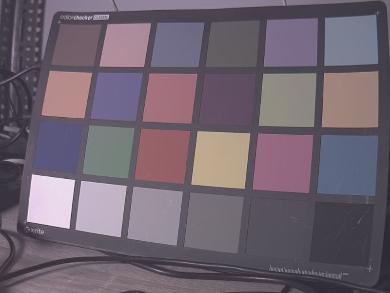
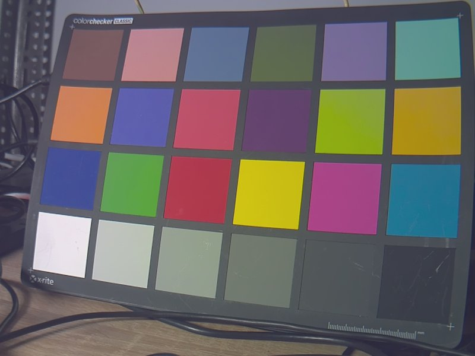

# OV5647 (Raspberry Pi Camera v1) driver for NVIDIA Jetson

A Linux driver for the Raspberry Pi Camera Module v1 (OmniVision OV5647)
on NVIDIA Jetson boards. It gives raw Bayer capture through V4L2 on all
supported boards, and the hardware ISP (debayer, auto exposure, auto
white balance) through Argus on the Nano and the Xavier NX. JetPack has
no driver for this sensor, and the earlier projects are commercial,
unmaintained or raw-only ([docs/prior-art.md](docs/prior-art.md)).

## Quick start

| Board | L4T | Raw V4L2 | ISP (Argus) | Second camera |
|---|---|---|---|---|
| Jetson Nano 2GB | R32.7 (JetPack 4.6.1 or later) | yes | yes | no, one connector |
| Jetson Xavier NX devkit | R35 (JetPack 5.0.2 or later) | yes | yes | yes |
| Jetson Orin Nano/NX devkit | R39 (JetPack 7) | yes | no | yes |

1. With the board powered off, plug the camera into CAM0. Orin devkits
   have 22-pin connectors and need a 15-to-22-pin ribbon.
2. Install on the board and reboot:

       git clone https://github.com/akandr/ov5647-jetson && cd ov5647-jetson
       sudo ./install.sh          # add --dual for a camera in each connector
       sudo reboot

3. Test:

       # raw Bayer (all boards)
       sudo apt install v4l-utils
       v4l2-ctl -d /dev/video0 --set-ctrl=sensor_mode=1 \
                --set-fmt-video=width=1920,height=1080,pixelformat=BG10 \
                --stream-mmap --stream-count=30 --stream-to=frames.raw

       # ISP, 1920x1080 (Nano, Xavier NX), last frame in test.jpg
       gst-launch-1.0 nvarguscamerasrc num-buffers=60 \
               ! 'video/x-raw(memory:NVMM),width=1920,height=1080' \
               ! nvjpegenc ! multifilesink location=test.jpg

4. On the Nano and the Xavier NX, install the ISP override file
   `isp/camera_overrides_noir.isp` as shown under Colour below. It
   removes the magenta cast of the NoIR module under LED light.

The installer builds the module against the board's kernel headers,
merges a device tree overlay into a copy of the board's DTB and points
`extlinux.conf` at the copy. The stock DTB is not modified, and the
original `extlinux.conf` is kept as `extlinux.conf.orig`.

- `sudo ./install.sh --uninstall && sudo reboot` removes the module and
  the DTB copy and restores `extlinux.conf`. An ISP override file stays
  until `/var/nvidia/nvcam/settings/camera_overrides.isp` is deleted.
- After an L4T update, reboot, run `sudo ./install.sh` again and reboot
  once more. The update rewrites the boot entry, and a new kernel needs
  the module rebuilt.
- `install.sh` does not remember `--dual`. With two cameras, pass it on
  every run.
- `sudo tests/install-check.sh` checks an installation step by step.

## Modes

| `sensor_mode` | Resolution | Default fps | Maximum fps |
|---|---|---|---|
| 0 | 2592x1944 | 15 | 15.0 |
| 1 | 1920x1080 | 30 | 32.8 |
| 2 | 1296x972, 2x2 binned | 30 | 32.2 |
| 3 | 640x480 | 90 | 93.7 |
| 4 | 1280x720, binned, 16:9 crop | 60 | 60.0 |

- The `sensor_mode` control picks the mode, and the V4L2 format must
  match its resolution. Otherwise the Nano and the Xavier NX silently
  deliver full resolution, and the Orin times out.
- For mode 0 through Argus, put `framerate=15/1` in the caps. Without
  it the stream is refused.
- Raw 1296x972 on the Xavier NX and the Orin needs
  `bytesperline=2624` in `--set-fmt-video`. Without it every second
  line comes out shifted by 16 pixels. The Nano uses 2624 by itself, so
  a raw 1296x972 file has 2624-byte lines on every board.
- Control units: `exposure` in microseconds, `gain` in sixteenths
  (16 is 1x), `frame_rate` in millionths of a frame per second.
- Exposure stops at the frame length, about 33 ms at 30 fps. For longer
  exposures, lower `frame_rate` while streaming. A `frame_rate` set
  before streaming is reset at stream start, unless the VI control
  `override_enable` is 1.
- Raw samples are 10-bit and right-aligned on R32, and scaled to 16 bits
  on R35 and JetPack 7.

## Colour

Without a tuning for this sensor, Argus uses a generic one made for
another sensor, and images turn magenta. `isp/camera_overrides_noir.isp`
corrects the colours of the NoIR module (no infrared filter) under LED
light. It was not tested on the standard module with an infrared
filter. To install it, from the cloned directory:

    sudo cp isp/camera_overrides_noir.isp /var/nvidia/nvcam/settings/camera_overrides.isp
    sudo chmod 664 /var/nvidia/nvcam/settings/camera_overrides.isp
    sudo rm -f /var/nvidia/nvcam/settings/nvcam_cache_*.bin
    sudo systemctl restart nvargus-daemon

| generic L4T tuning | `camera_overrides_noir.isp` |
|---|---|
|  |  |

Under LED light the mean colour error on a ColorChecker (ΔE) is 31 to
35 with the generic tuning and 10 to 14 with the file.

Outdoors the tuning failed. The NoIR module records infrared along with
visible light, and no override file gave usable colours.
[docs/isp-tuning.md](docs/isp-tuning.md) has the measurements and the
method.

## Usage notes

- With `--dual` the camera in CAM1 is `/dev/video1`, or `sensor-id=1`
  in Argus.
- After an Argus pipeline, raw capture returns no frames until the
  sensor driver is rebound. `ls /sys/bus/i2c/drivers/ov5647` shows the
  device name, `6-0036` on the Nano, `9-0036` on the Xavier NX:

      echo 9-0036 | sudo tee /sys/bus/i2c/drivers/ov5647/unbind
      echo 9-0036 | sudo tee /sys/bus/i2c/drivers/ov5647/bind

- A raw capture that returns nothing can also mean another process
  still holds the device. `sudo fuser -v /dev/video0` names it.
- Argus errors appear in `journalctl -u nvargus-daemon`. GStreamer only
  reports "Internal data stream error".
- For a camera mounted upside down, add `horizontal-mirror;` and
  `vertical-flip;` to its sensor node in the board's overlay in `dt/`
  (`*-dual-overlay.dts` for two cameras). Then run `sudo ./install.sh`
  again, with `--dual` if used, and reboot. A mirrored image needs only
  `horizontal-mirror;`. The Bayer order stays BGGR.
- `v4l2-ctl -d /dev/video0 --get-ctrl otp_data` reads the module's
  identity, to tell several modules apart.
- `/sys/kernel/debug/ov5647-<bus>-0036/` gives register access and the
  sensor's test pattern, see [docs/internals.md](docs/internals.md).

## Tests

On the board, with a camera:

- `sudo tests/capture-check.sh` captures every mode, raw and through
  Argus, and checks geometry, size and content. Use `--raw-only` on the
  Orin.
- `sudo tests/control-check.sh` checks that frame rate, exposure, gain
  and the test pattern reach the sensor. Exposure and gain need light.
- `sudo tests/soak.sh [minutes]` runs one long ISP capture and watches
  memory, temperature and the frame rate.

CI builds the module against the newest kernel headers of all three L4T
lines, on pushes to main, on pull requests and weekly. It also checks
the mode tables against the overlays and each ISP file against its JSON
source. No frames pass through CI.

`v4l2-compliance` passes every control test. Its remaining failures
come from NVIDIA's VI layer and from tests of interfaces newer than the
L4T kernels. No L4T line offers `read()` or USERPTR buffers. R32 and
R35 also lack `G/S_PARM` and `CREATE_BUFS`.

## Known limitations

- Orin: raw capture only. Argus on JetPack 7 needs a per-sensor tuning
  file (NITO), and none exists for this sensor.
- A prebuilt module from a release loads only on the exact kernel it
  was built for (`modinfo -F vermagic`). Otherwise build it with
  `install.sh`.

## Layout

    driver/     kernel module (tegracam), shared by all boards
    dt/         device tree overlays, one directory per board
    tests/      checks run on the board
    isp/        ISP override files and their JSON sources
    tools/isp/  tools that measure a chart and build an override file
    docs/       internals, ISP tuning, prior art, figures
    .github/    CI

## Provenance and licensing

GPL-2.0. The register tables come from the mainline Linux driver
`drivers/media/i2c/ov5647.c` (Copyright (C) 2016, Synopsys, Inc.,
driver by Ramiro Oliveira). [docs/internals.md](docs/internals.md) lists
where they differ and why. The driver structure and the overlays follow
NVIDIA's public L4T sources: the tegracam framework, the IMX219
reference driver and the camera device trees. No proprietary,
NDA-covered or employer-derived material is included, and the file
headers keep the upstream copyright notices.

Artur Andrzejczak <andrzejczak.artur@gmail.com>. Developed with AI
assistance, see the commit trailers.
