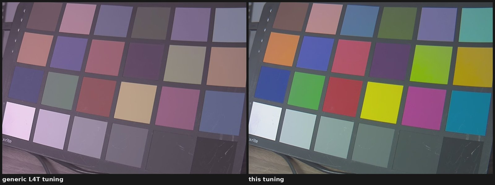
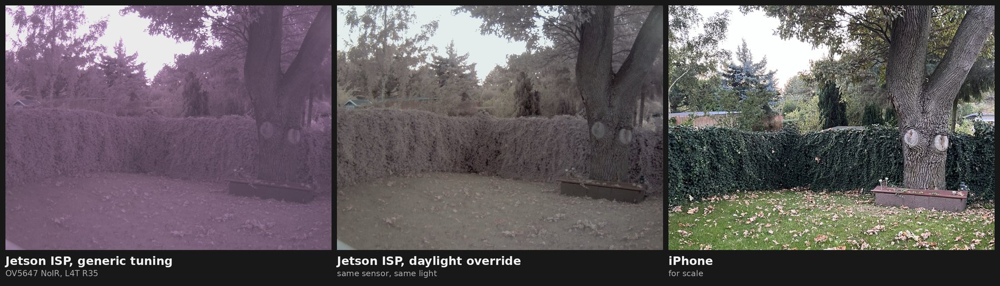

# OV5647 (Raspberry Pi Camera v1) driver for NVIDIA Jetson

A driver for the OmniVision OV5647 sensor (Raspberry Pi Camera Module
v1) on NVIDIA Jetson boards, integrated with the NVIDIA camera stack.
One source builds on L4T R32, R35 and JetPack 7 (kernels 4.9, 5.10 and
6.8), and the installer detects the board. On the Nano and the Xavier
NX the sensor works with the hardware ISP (AE, AWB, debayer) through
`nvarguscamerasrc`, with zero-copy NVMM buffers, in every mode. Raw
V4L2 Bayer capture works in every mode too. On the Orin only the raw
path works so far.

A ColorChecker through the ISP of a Xavier NX under an LED source. On
the left is the generic L4T tuning. On the right is the same scene
after calibration with `isp/camera_overrides_noir.isp`.

Outdoors the result is weaker. The modules used here are the NoIR
variant and have no infrared cut filter, so foliage comes out pale and
colourless with any tuning. The phone picture on the right is for
scale. [docs/isp-tuning.md](docs/isp-tuning.md) has the measurements
and the reasons.

## Why this exists

The Pi Camera v1 carries the OV5647. JetPack ships drivers for the
IMX219 (Pi Camera v2) and the IMX477 (HQ camera) and has none for this
sensor. On every L4T release the camera and the board do not work
together out of the box.

No maintained open-source driver exists. RidgeRun sells a closed one,
last documented for L4T 32.1. A 2019 alpha by jas-hacks shipped
prebuilt binaries for L4T 32.2 and was never maintained. The other
projects are unmaintained, incomplete, or limited to raw V4L2 capture
with no ISP. The ISP provides hardware debayer, auto exposure, auto
white balance and DMA into NVMM buffers, which CUDA and the encoders
use without a copy. [docs/prior-art.md](docs/prior-art.md) lists each
project and what it covers.

## Support matrix

| Board | L4T | Raw V4L2 | ISP (Argus) | Two cameras |
|---|---|---|---|---|
| Jetson Nano 2GB (P3448-0003) | R32.7.6 / JetPack 4.6.6 | all five modes | all five modes | one connector |
| Jetson Xavier NX devkit (P3668) | R35.x / JetPack 5 | all five modes | all five modes | yes, streaming at once |
| Jetson Orin Nano/NX devkit (P3767) | JetPack 7 / L4T r39 | all five modes | does not run, see Known limitations | yes, streaming at once |

The Nano 2GB, the Xavier NX and the Orin were tested with cameras
attached, using the driver and overlays as committed. A 900-frame 1080p
run through the ISP reports no dropped buffers. With two cameras, the
OTP identities confirm that the two video nodes are two different
modules.

| `sensor_mode` | Resolution | Default fps | Maximum fps |
|---|---|---|---|
| 0 | 2592x1944 | 15 | 15.6 |
| 1 | 1920x1080 | 30 | 32.8 |
| 2 | 1296x972 | 30 | 32.2 |
| 3 | 640x480 | 62 | 62.5 |
| 4 | 1280x720 | 60 | 60.0 |

Mode 2 is a 2x2-binned readout of the full sensor. Mode 4 is the same
readout cropped vertically to 16:9 (see Known limitations).

## How the capture path works

The Pi Camera v1 is a 5 MP rolling-shutter sensor with a 2-lane MIPI
CSI-2 link and 10-bit Bayer output (BGGR). The module has its own
25 MHz oscillator and switches its regulators from the ribbon's enable
pin. The driver therefore needs one GPIO and no clock or regulator
handling. While that pin is low the sensor does not answer on I2C.

On the Jetson the frame takes this path:

    OV5647 --2-lane CSI--> NVCSI --> VI --DMA--> system memory --> /dev/video0

NVCSI is the CSI-2 receiver. VI (video input) writes the raw Bayer
frames to memory by DMA. This is the V4L2 path. The pixels are the
sensor's own, with no debayer or correction. VI pads each line to a
64-byte boundary (see Bring-up notes).

The ISP path adds one block:

    OV5647 --> NVCSI --> VI --> ISP (debayer, AE, AWB) --> NVMM buffers

`nvargus-daemon` runs this pipeline. It drives exposure and white
balance through the same driver controls a V4L2 application uses
(gain, exposure, frame rate). It returns RGB or YUV frames in NVMM
buffers, which `nvarguscamerasrc`, the hardware encoders and CUDA use
without a copy.

The driver is a tegracam driver. tegracam is NVIDIA's kernel framework
for camera sensors. The driver supplies a table of modes and a few
operations (power on and off, set mode, start and stop streaming, set
gain, exposure and frame rate). The framework builds the V4L2
subdevice, the media controller graph and the controls around them.
The mode list exists twice. The driver holds the register tables, the
device tree holds the timing properties, and the two must agree (see
Bring-up notes).

On a running Nano:

    $ dmesg | grep ov5647
    [    3.908647] ov5647 6-0036: tegracam sensor driver:ov5647_v2.0.6
    [    3.939281] ov5647 6-0036: OV5647 detected (chip id 0x5647)
    [    3.939355] vi 54080000.vi: subdev ov5647 6-0036 bound
    [    3.940301] ov5647 6-0036: detected ov5647 sensor

    $ media-ctl -p -d /dev/media0
    - entity 1: nvcsi--1 (2 pads, 2 links)
                type V4L2 subdev subtype Unknown flags 0
                device node name /dev/v4l-subdev0
        pad0: Sink
            <- "ov5647 6-0036":0 [ENABLED]
        pad1: Source
            -> "vi-output, ov5647 6-0036":0 [ENABLED]

    - entity 4: ov5647 6-0036 (1 pad, 1 link)
                type V4L2 subdev subtype Sensor flags 0
                device node name /dev/v4l-subdev1
        pad0: Source
            [fmt:SBGGR10_1X10/2592x1944 field:none colorspace:srgb]
            -> "nvcsi--1":0 [ENABLED]

    - entity 6: vi-output, ov5647 6-0036 (1 pad, 1 link)
                type Node subtype V4L flags 0
                device node name /dev/video0
        pad0: Sink
            <- "nvcsi--1":1 [ENABLED]

## The device tree overlays

The project does not reflash a board. Each board gets a device tree
overlay. `fdtoverlay` merges it into a new DTB, and one `FDT` line in
`extlinux.conf` selects that DTB. The stock DTBs stay untouched. The
installer keeps a copy of the base it merged onto, so a second run
does not apply the overlay twice. To revert, restore the backed-up
`extlinux.conf` and delete the module and the installer's files under
`/boot`. The installer prints the exact commands.

The base DTB depends on the board. On the Nano and the Xavier NX it is
a file in `/boot`, named by `extlinux.conf` when the board already has
an `FDT` line. On JetPack 7 the DTB comes from UEFI and extlinux names
no file. The first install there merges onto `/sys/firmware/fdt`, the
live tree and the only copy the running system has. Later runs use the
snapshot the first install kept, since by then the live tree is the
merged one.

The boards fall into two groups.

- The Nano (R32) and the Xavier NX (R35) ship DTBs with the complete
  camera graph, wired for the stock IMX219. The overlay disables the
  IMX219 node, adds the OV5647 on the camera I2C bus, points the NVCSI
  input endpoint at it and renames the `tegra-camera-platform` entry.
  Most of the file is the sensor node with its five modes. The rewiring
  takes a few lines.
- JetPack 7 (Orin) ships a DTB with the SoC blocks and no camera
  wiring. `tegra-capture-vi` and the NVCSI controller have no ports or
  channels, and there is no sensor, no camera I2C mux and no
  `tegra-camera-platform`. The overlay supplies all of it. It extends
  three existing nodes by path (`tegra-capture-vi`, the NVCSI
  controller and the main GPIO node), adds the rest, and refers to the
  base tree through three phandles (`&gpio`, `&gpio_aon`, `&cam_i2c`).
  NVIDIA's IMX219 overlay for this carrier sets swapped CSI lane
  polarity (`lane_polarity = "6"`) on CAM0 and none on CAM1. This
  overlay does the same, and both connectors capture with it. It also
  sets `discontinuous_clk = "yes"`. The Orin's receiver needs it, and
  the other boards use `"no"` (see Known limitations).

Each mode node in the overlay repeats the timing of its register table
(line length and pixel clock). The framework computes exposure and
frame-rate register values from these device tree numbers. Frame
length is the exception. It exists only in the driver, which writes
each mode's nominal value in `set_mode`.

### Orientation

A module mounted upside down or facing a mirror is corrected in the
sensor node with one or both of these properties:

    horizontal-mirror;
    vertical-flip;

They apply to every mode. The names follow NVIDIA's reference sensor
drivers. Orientation has to come from the device tree, because the
tegracam control list is fixed and has no flip control
(`V4L2_CID_HFLIP`, `V4L2_CID_VFLIP`).

Flipping an axis reverses the readout order. That moves the Bayer
phase by one pixel, and the frames would start on a different colour
from the `bggr` the overlay declares. The driver compensates, so the
advertised format holds in every orientation. The two axes need
different corrections, found by measurement. Horizontally the phase
follows the width of the readout window, so only its left edge moves.
The line length on the wire comes from the output size register and
stays the same. Vertically both edges move. Moving only one drops a
line, and the VI then waits for a frame that never completes. That
shows up as `MW_ACK_DONE syncpoint time out` and frames of zeroes.

On R32 and R35 the image mirrors in both axes. A frame captured with
both properties set correlates +0.90 on one board and +0.73 on the
other with the baseline frame turned over, and near zero with the
baseline as it was. The Bayer phase holds in all five modes, each
compared with full resolution under the same light.

Two things make this check easy to get wrong. An LCD is a poor target.
An unbinned mode resolves its subpixel stripes, so mirroring the image
moves colour onto another Bayer position. That looks the same as a
phase error in the driver. Also, judge the phase by where red lands.
Any shift of the mosaic moves red. Blue and green can differ by a
fraction of a percent depending on the light, so the darkest channel
gives no reliable answer.

The mode tables read out mirrored already, so the driver toggles the
mirror bits. `horizontal-mirror` therefore reverses what the tables
do. A user asking for a mirror expects exactly that change.

### Module identity

Each sensor has 256 bits of one-time programmable memory, which the
module vendor uses for identification. The driver reads it once at
probe and exposes it as a control:

    v4l2-ctl -d /dev/video0 --get-ctrl otp_data

The two Raspberry Pi Camera v1 modules used here return five populated
bytes each, and the bytes differ between them. The value tells one
camera from another on a bench with several. A module with blank
memory reads as zeroes, and probe continues.

The read needs the sensor's internal clock, which runs only out of
standby. The driver enables streaming briefly for the read. With the
sensor powered and idle, as during most of probe, the buffer reads
back empty.

## Install

The camera goes in the CAM0 connector. Boards with two connectors take
a second camera with the two-camera overlay (`--dual`). Orin devkits
have 22-pin connectors and need a 15-to-22-pin adapter ribbon.

On the board:

    git clone https://github.com/akandr/ov5647-jetson && cd ov5647-jetson
    sudo ./install.sh
    sudo reboot

The installer detects the board and installs the build dependencies
(`device-tree-compiler`, the L4T kernel headers, and on JetPack 7 the
out-of-tree headers). It builds the module against the installed
kernel headers and merges the board's overlay onto the DTB the board
boots (see The device tree overlays). It then points the `FDT` line of
the `DEFAULT` boot entry in `extlinux.conf` at the merged copy. The
original `extlinux.conf` is kept as `extlinux.conf.orig`. A successful
run ends with the revert commands: restore that backup, delete the
module from `/lib/modules/$(uname -r)/updates` and the installer's
files under `/boot`, run `depmod -a` and reboot.

After the reboot:

    # ISP path, 1080p30 through hardware debayer/AE/AWB (Nano, Xavier NX)
    gst-launch-1.0 nvarguscamerasrc ! 'video/x-raw(memory:NVMM),width=1920,height=1080' ! fakesink

    # raw Bayer path (all three boards)
    v4l2-ctl -d /dev/video0 --set-ctrl=sensor_mode=1 \
             --set-fmt-video=width=1920,height=1080,pixelformat=BG10 \
             --stream-mmap --stream-count=30 --stream-to=frames.raw

The overlay sets `use_sensor_mode_id`, so the `sensor_mode` control
selects the mode. The requested format must still match that mode's
resolution. With a size the selected mode does not produce, the driver
falls back to its default mode and silently delivers full-resolution
frames. On the Orin a mismatch is worse. The node reports full
resolution, the sensor streams the mode `sensor_mode` selects, and
every capture times out.

On the Xavier NX and the Orin the 1296x972 mode needs an explicit line
stride. VI reports 2592 bytes per line but writes every line at a
64-byte boundary, so each odd line starts 32 bytes early. Its first 16
pixels land at the end of the line above, and its last 16 pixels stay
zero. A naive demosaic then shows colour fringes on vertical edges.
Ask for an aligned stride:

    v4l2-ctl -d /dev/video0 --set-ctrl=sensor_mode=2 \
             --set-fmt-video=width=1296,height=972,pixelformat=BG10,bytesperline=2624 \
             --stream-mmap --stream-count=30 --stream-to=frames.raw

Setting the `preferred_stride` control to 2624 before the format has
the same effect. The Nano pads the line to 2624 bytes by itself. The
other modes give lines that are already a multiple of 64 bytes, and
Argus is not affected.

`tests/capture-check.sh` checks every raw mode and every ISP mode. A
frame count alone proves little here. `v4l2-ctl` keeps streaming in
the previous format when a requested one is rejected, so the script
confirms that the device accepted the geometry and that the file holds
exactly the expected number of bytes. It asks for a 64-byte aligned
stride and fails if odd lines end in zeroes. It also reports the
spread of pixel values. A covered lens delivers full frame counts too,
and the spread is what tells it from a working sensor.

`tests/control-check.sh` checks that the controls reach the sensor.
Frames can arrive with correct geometry while exposure, gain and frame
rate are ignored, and a capture test would not notice. The script
sweeps exposure and gain against the sensor black level, counts frames
to check the frame rate, and turns on the sensor's bar pattern through
the register interface. Exposure and gain need a lit scene. With a
covered lens the script reports those two as inconclusive.

Three properties of the framework shape any such test, and each looks
like a driver bug at first:

- The VI channel's `override_enable` control decides whether the
  framework writes stored controls back at stream start. It defaults
  to 0, and Argus sets it to 1. The driver writes gain and exposure
  back itself, so both hold either way. A frame rate set before
  streaming applies only with `override_enable=1`.
- Every stream start sets the frame length again, from the default
  rate the device tree gives the mode. A frame rate set for one stream
  is gone in the next. The rate can only be measured within one
  continuous stream.
- Writing a control its current value does nothing. The framework
  drops the write, so a second measurement with the same exposure as
  the first runs on whatever the sensor already had. Sweeps must step
  through different values, or set the control to another value first.

### What CI covers

The two scripts above need a board and a camera. The build does not.
NVIDIA publishes the kernel headers of each L4T line as `.deb`
packages. `.github/scripts/build-l4t.sh <nano|xavier|orin>` fetches
the newest headers of a line, unpacks them into a temporary sysroot and
builds the module against them. Any aarch64 Linux machine can run it,
with no Jetson involved.

The workflow does this for all three lines on every push and every
Monday. The weekly run matters most. The driver depends on NVIDIA's
out-of-tree tegracam framework, whose headers and exported symbols
change between L4T releases, and an old build says nothing about the
current headers. Linking is checked as well. Each line's
`Module.symvers` lists the tegracam symbols, so a removed function
fails the build before any `insmod`.

The same workflow runs `.github/scripts/check-modes.py`. It reads the
driver's mode tables and every overlay and checks that they agree on
mode order, output size, line length, a pixel clock that matches the
PLL multiplier, and the CSI clock mode measured for each board. Each
of these has broken capture here at least once, and none of them shows
up at build time.

No frame passes through CI, so it cannot show that the driver works.
Streaming, controls, orientation and the ISP path are tested only by
the scripts above, on a board with a camera.

### v4l2-compliance

With v4l-utils 1.33.0, the conformance suite passes on the driver's
own interface. The failures all come from the VI layer below it. On
each board, after `sudo systemctl stop nvargus-daemon`:

    v4l2-compliance -d /dev/video0        # Nano 44/48, Xavier 44/48, Orin 47/48
    v4l2-compliance -d /dev/video0 -s     # Nano 44/59, Xavier 46/59, Orin 55/59

Every control test passes. Every failure is in NVIDIA's VI channel or
due to the age of the kernel. R32 and R35 give the same failures:

- `VIDIOC_G/S_PARM` is not implemented, although the same channel
  answers `VIDIOC_ENUM_FRAMEINTERVALS` from the driver's mode table.
  The frame rate on this stack is the `frame_rate` control.
- `VIDIOC_CREATE_BUFS` returns EINVAL. The MMAP streaming tests call it
  and fail too, the REQBUFS variants included. Ordinary `REQBUFS`
  streaming works.
- `read()` and USERPTR buffers are not supported. The channel offers
  MMAP and DMABUF only.
- `VIDIOC_REMOVE_BUFS`, requests and the invalid-ioctl check test
  interfaces newer than these kernels.

The Orin's VI channel on JetPack 7 implements `S_PARM` and
`CREATE_BUFS`, and those tests pass there. It has no `read()` or
USERPTR either. A `DQBUF` blocked in one thread does not return when
another thread calls `STREAMOFF`, and the first buffer has sequence
number 1. Both connectors give the same result.

An application that uses `S_PARM`, `read()` or user pointers needs
changes to run on this stack, with any sensor.

## Colour on the ISP

On R32 and R35 the ISP falls back to a generic tuning made for another
sensor, and images come out magenta. `isp/camera_overrides_noir.isp`
corrects white balance and colour for the NoIR module used here. It was
fitted to a ColorChecker and checked on the Xavier NX ISP:

| light source | generic tuning | with the override |
|---|---|---|
| warm LED | 41.7 | 17.9 |
| neutral LED | 37.3 | 11.3 |
| cool LED | 32.3 | 11.1 |

The numbers are the mean ΔE over the chart's colour patches, lower is
better. Outdoors the missing infrared filter limits what any tuning can
do. To install the file:

    sudo cp isp/camera_overrides_noir.isp /var/nvidia/nvcam/settings/camera_overrides.isp
    sudo chmod 664 /var/nvidia/nvcam/settings/camera_overrides.isp
    sudo rm -f /var/nvidia/nvcam/settings/nvcam_cache_*.bin
    sudo systemctl restart nvargus-daemon

[docs/isp-tuning.md](docs/isp-tuning.md) describes the measurements,
the method, how the numbers become the file, and the limits.

## Control ranges in practice

The current frame length limits exposure. At 30 fps the frame is 1435
lines, so exposure stops at 1427 lines, about 33 ms, whatever value is
written. The control still accepts up to 500 ms. A lower frame rate
opens the range: at 4 fps the driver reaches 10760 lines. The limit is
the sensor's own, and the advertised maximum gives no hint of it.

Raw sample scaling differs between L4T generations. Code that reads
frames from more than one board has to allow for it. The sensor's bar
pattern reads 1023 / 511 / 0 on R32 and 65535 / 32767 / 0 on R35. The
10-bit values are right-aligned on R32 and expanded to the full 16-bit
range on R35. Normalise by the format.

### Prebuilt artifacts

A release has the source tarball, the three device tree overlays and
one kernel module per L4T line. The overlays work as they are. The
installer compiles the same files from `dt/`, so a prebuilt `.dtbo`
merges onto a board's DTB the same way.

The modules are more limited. The kernel loads a module only when its
vermagic matches the running kernel exactly, down to the patch level,
so a prebuilt module fits only the release it was built on:

    uname -r                                    # what the board runs
    modinfo -F vermagic ov5647-nano-*.ko        # what the module needs

If the two differ, build from source, as `install.sh` does. Every
release lists the kernel version, L4T release and vermagic of each
module in its manifest.

## Bring-up notes

Problems that took real debugging time:

- T210 (Nano) rejects every frame of this sensor with the mainline
  register tables. Those tables program a gated MIPI clock. The Nano's
  VI counts frames at the right rate, rejects each one with
  `tegra_channel_error_status: error 20022` and delivers zero bytes.
  The fix is a continuous clock on both sides: `0x4800 = 0x04` in every
  mode table and `discontinuous_clk = "no"` in the device tree. The
  relevant bit is bit 5, the clock lane gate. Mainline sets it and the
  clock lane stops between packets. These tables clear it, and the
  clock runs continuously.
- The tables came from mainline and differ from it in four places, each
  with a reason. Two are deliberate. One is the clock gate above. The
  other is 0x0100, which stays 0 because separate start and stop tables
  drive streaming. Two are harmless. These tables write the line length
  to 0x380c and 0x380d, where mainline leaves the reset default, with
  the values mainline assumes. They also set 0x3821 bit 2,
  `r_mirror_isp`, which has no measurable effect here because the
  sensor's own ISP is outside the raw path.

  A fifth difference has since gone. In December 2025 mainline unified
  the PLL across the full, 1080p and binned modes. These tables had
  kept the older split, with the middle two modes at 81.67 MHz against
  87.5 MHz. The newer value was measured before it was adopted. Writing
  0x3036 during a stream through the register interface, on a Nano and
  on a Xavier NX, moved the binned mode from 30.1 to 32.2 fps and 1080p
  from 30.7 to 32.9 fps. Neither the VI nor the CSI logged anything on
  either board. The tables now use mainline's multiplier and the
  overlays the matching clock. The default frame rate in both modes
  stays at the 30 fps that applications and Argus expect. Only the
  maximum rate changed.
- The failure signature points to the cause. Frames counted and
  rejected point to link integrity, so check the clocking. No frames at
  all point to mode timings, lanes or the ribbon cable. Short-frame
  errors point to a geometry mismatch between the table and the device
  tree.

  No frames and no CSI error, while the sensor reports streaming, meant
  a receiver set for the wrong clock lane behaviour: `discontinuous_clk`
  on the Orin.
- A raw capture that returns zero bytes has two causes on the Nano and
  the Xavier NX, and neither needs a reboot. Both were first mistaken
  for a stuck VI queue. The Orin has a third cause, which does need a
  power cycle, see Known limitations.

  The first is a stale process holding the device. Killing a capture
  started as `timeout 40 v4l2-ctl ...` signals the wrapper and leaves
  v4l2-ctl streaming under init. An unprivileged `pkill` against a
  stream started with sudo fails silently. `fuser /dev/video0` names
  the holder when run as root, and killing it restores capture at once.

  The second follows any Argus pipeline. After `nvarguscamerasrc` has
  run, raw V4L2 capture returns nothing on R32 and R35, whether or not
  `nvargus-daemon` is stopped, and waiting does not help. The sensor is
  fine. During the failed capture it reads 0x0100 = 1 with its mode
  registers intact, as in a working stream. The kernel logs
  `__vb2_queue_cancel` warnings from videobuf2-core, which appear when a
  driver does not return its buffers in `stop_streaming`. The frames
  are lost in the Tegra VI. Rebinding the sensor driver rebuilds the
  channel:

      echo 9-0036 | sudo tee /sys/bus/i2c/drivers/ov5647/unbind
      echo 9-0036 | sudo tee /sys/bus/i2c/drivers/ov5647/bind

  (`9-0036` on the Xavier NX and `6-0036` on the Nano; `ls
  /sys/bus/i2c/drivers/ov5647` shows the right one.) The scripts in
  `tests/` rebind before the raw checks and after the Argus checks, so
  they can run twice in a row.
- The device tree's `pix_clk_hz` must match the pixel clock that the
  mode's PLL registers produce. The framework derives exposure and
  frame-rate values from the device tree number. A wrong value fails
  silently. The VGA mode declared 55 MHz while its PLL gave 58.33 MHz,
  so it ran 6% fast with exposure off by the same factor. Nothing
  reported it. It came to light only when the rate was measured (a
  400-frame capture timed against a 100-frame one, to cancel the
  start-up cost) and compared with the declared value. CI now checks
  every declared value against its table's PLL multiplier.
- The mainline tables do not program VTS (frame length). Mainline sets
  it through the vblank control at runtime. Without it the sensor runs
  at its reset default, 17 fps for 1080p where 30 is expected. The
  driver writes each mode's nominal VTS.
- An Argus pipeline needs the frame rate in its caps whenever the mode
  cannot reach 30 fps. Without it `nvarguscamerasrc` asks for its
  default of 30. The 15 fps full-resolution mode cannot provide that,
  and the stream is refused. This README once blamed the ISP for
  rejecting the 2592-wide mode. That was wrong. With `framerate=15/1`
  in the caps the mode streams on R32 and R35. Only the Nano names the
  cause ("Frame Rate specified is greater than supported"). The Xavier
  NX reports `NvBufSurfaceFromFd Failed`. That message suggests a
  buffer problem, and it made the fault look like a memory or
  resolution limit.
- The order of `frmfmt[]` in the driver must follow the `modeN` nodes
  in the device tree. The framework looks up control properties by
  index, and a mismatch computes exposure with another mode's line
  length without any error.
- JetPack 7 ships the tegracam headers in `/usr/src/nvidia` without the
  generated `nvidia/conftest.h` they include. One of its macros gates a
  field in `struct camera_common_data`. A wrong guess makes the struct
  layout disagree with the precompiled `tegra-camera.ko`.
  `driver/compat/` has a replacement with each value checked against
  the running kernel.
- The line stride of the 1296-wide mode depends on the release. R32
  pads it to 2624 bytes. R35 and JetPack 7 report 2592 bytes, a
  stride VI cannot write (see the raw Bayer path above). Read the
  stride from the format.
- The driver exposes registers under
  `/sys/kernel/debug/ov5647-<i2c-addr>/`. `regs` dumps the relevant
  ranges (system, AEC/AGC, timing, MIPI, ISP). `reg` takes `<addr>` to
  select a register or `<addr> <value>` to write one, both in hex, and
  reading it returns the selected register. Reads bypass the regmap
  cache and return what the sensor holds. The sensor answers over I2C
  only while it is powered, during capture. At other times both files
  report that and leave the bus alone.

      # while a capture is running
      echo 0x300a > /sys/kernel/debug/ov5647-6-0036/reg
      cat /sys/kernel/debug/ov5647-6-0036/reg      # 0x300a 0x56

  `test_pattern` selects the sensor's image generator by name: `off`,
  `bars` or `squares`. The pattern replaces the pixel array and tests
  CSI, VI and the capture path with no light, lens or scene.

      echo bars > /sys/kernel/debug/ov5647-6-0036/test_pattern

  The datasheet lists a third type, random data. This sensor renders it
  the same as the colour bar, so it has no name here. The `reg` file
  still reaches it, along with the bar styles and the rolling bar.

  The `reg` file also reaches registers the driver does not use.
  Writing `0x503d 0x80` turns on the colour bar by hand. On a dark bench
  the frame mean goes from 13 to 511 and the column variance from 1 to
  359. Write `0x00` or restart the stream to turn it off, since the
  mode tables reset it.
- Argus errors appear in `journalctl -u nvargus-daemon`. The GStreamer
  client only reports "Internal data stream error".

## Known limitations

- Without an override file the ISP uses a generic tuning made for
  another sensor, and images pull magenta. The override file in `isp/`
  is checked on R35 only and is untested outdoors. See Colour on the
  ISP.
- Raw V4L2 capture and Argus do not mix within one session. After an
  Argus pipeline the raw path delivers no frames until the sensor
  driver is rebound. This happens on both L4T generations while the
  sensor still streams correctly, so the cause is in the VI (see
  Bring-up notes for the evidence and the remedy).
- The maximum rates in the mode table follow from the timings (pixel
  clock / line length / frame length). Modes 0, 3 and 4 use them,
  rounded down, as their default. Modes 1 and 2 default to 30 and leave
  the rest as headroom for the frame-rate control. The control reaches a
  requested rate to within one line time, since frame length is set in
  whole lines.
- Mode 4, 1280x720 at 60 fps, is the binned readout with its vertical
  window cut to 1464 array rows. The shorter frame makes 60 fps
  possible. It covers the full width and about three quarters of the
  height. The result is a 16:9 crop of the scene, with no scaling.
- Group hold uses one of the sensor's four register groups, so an
  exposure update (three byte writes) reaches the sensor as one and
  cannot straddle a frame boundary. Reading 0x3500-0x3502 over I2C
  while streaming confirms it. Writes made under the hold appear only
  when the group is launched, and the image changes only then.
- On the Orin the raw V4L2 path captures all five modes. Argus does not
  run.

  The raw path needed `discontinuous_clk = "yes"` in the overlay. The
  sensor drives a continuous clock, and T210 and T194 capture with
  `"no"`. T234 does not. With `"no"` its receiver never locks, NVCSI
  raises no interrupt, and the VI reports `uncorr_err: request timed
  out after 2500 ms`. NVIDIA's IMX219 overlay sets `"yes"` on this
  connector for the same reason. One value cannot serve all three
  boards. The Nano captures nothing with `"yes"`, and the Xavier NX
  captures all five modes with either value.

  640x480 needed a change to its register table. Mainline's sequence
  for this mode, alone among the five, writes 0xff to 0x3000-0x3002
  partway through and 0x00 later. That holds the sensor's blocks in
  reset for part of the sequence. The Nano and the Xavier NX capture
  anyway. The Orin's receiver never locked on it. Without those three
  writes every register ends with the same value, and the mode captures
  at 62 fps. The PLL, the MIPI clock period, the settle time and the
  frame width were tried first and made no difference. CI now rejects a
  block reset inside a mode table.

  A 1280x720 mode cut to 640 pixels wide captures on both connectors.
  An earlier test showed CAM0 failing below 1280 pixels. That test
  changed the mode table and left the driver's list of frame sizes
  unchanged, so the narrower format was rejected and the capture never
  matched the sensor.

  The old 640x480 table also left the capture path stuck. Every later
  capture in any mode timed out, and only a power cycle cleared it.
  Rebooting and reloading the module did not help, and unbinding the
  VI driver hangs the board. A capture that fails because the sensor
  mode and the format disagree leaves the path working. On 2026-10-03
  both connectors once timed out right after a reboot, and a power
  cycle cleared it. Nine reboots since have not repeated it.
  `tests/capture-check.sh` runs 640x480 last, so a failure there cannot
  affect the other modes.

  Argus on JetPack 7 requires a per-module NITO tuning file and does
  not start without one. No such file exists for this sensor. The file
  for the IMX219 loads, but the daemon then cannot match a tuning set
  to sensor mode 0 (`GetKnobSetIdFromSensorModeIndex failed`) and
  stops. The format is binary and keyed by GUIDs, with nothing that
  names a mode. On R32 and R35 a default tuning applies, so the same
  driver works with the ISP there. With the two-camera overlay and one
  camera, the daemon also fails on the empty connector first.

## Layout

    driver/     kernel module, tegracam framework, shared across boards;
                compat/ replaces NVIDIA's generated conftest.h on JetPack 7
    dt/nano/    DT overlay, Jetson Nano 2GB (L4T R32)
    dt/xavier/  DT overlays, Xavier NX devkit (L4T R35)
    dt/orin/    DT overlays, Orin Nano/NX devkit (JetPack 7)
    tests/      on-board checks: capture geometry and content, controls
    isp/        ISP override file for the NoIR module (L4T R35) and its source data
    tools/isp/  tools that measure a chart and build an override file
    docs/       prior art survey, ISP tuning notes, captures and figures
    .github/    CI: builds against all three L4T lines, no board needed

## Provenance and licensing

GPL-2.0. The code comes from public GPL-2.0 sources plus the
Tegra-specific work described in the bring-up notes. The register
sequences and their per-mode HTS/VTS start from the mainline Linux
`drivers/media/i2c/ov5647.c` (Copyright (C) 2016, Synopsys, Inc.,
driver by Ramiro Oliveira). The driver structure and the overlay
schemas follow NVIDIA's public L4T kernel sources and device trees
(the tegracam framework, the IMX219 reference driver and the per-board
camera device trees).

The register tables are mainline's. Compared with the mainline driver
as of 7.3-rc3 (its common sequence followed by each mode's), the four
tables mainline has end with the same value in every register except
four. `0x4800` selects a continuous MIPI clock for Tegra. `0x0100`
stays 0 because separate start and stop tables drive streaming.
`0x380c` and `0x380d` hold the line length, which these tables set and
mainline leaves at the reset default. The fourth is bit 2 of `0x3821`.
The Bring-up notes give the reason for each. The fifth table, 1280x720,
belongs to this port. It is the binned table with a changed vertical
window, output size and horizontal offset. The 640x480 table also
drops three writes that hold the sensor's blocks in reset partway
through, see Known limitations.

This port contributes the Tegra integration: the tegracam driver, VTS
programming, the control conversions, the multi-kernel build, the
installer, and in the overlays the wiring of each board (CSI
interface, lane polarity, GPIO and I2C mux) with mainline's timings in
tegracam's mode-property form. The overlays' graph structure,
sensor-node layout and property schema follow NVIDIA's IMX219
overlays, as each overlay header states.

No proprietary, NDA-covered or employer-derived material is included.
The file headers keep the upstream copyright notices.

Artur Andrzejczak <andrzejczak.artur@gmail.com>.
Developed with AI assistance, see the commit trailers.
