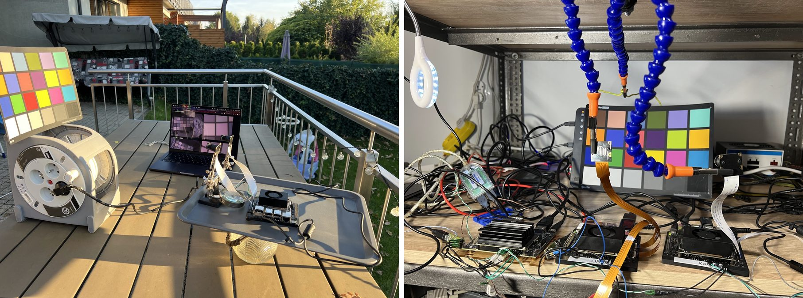
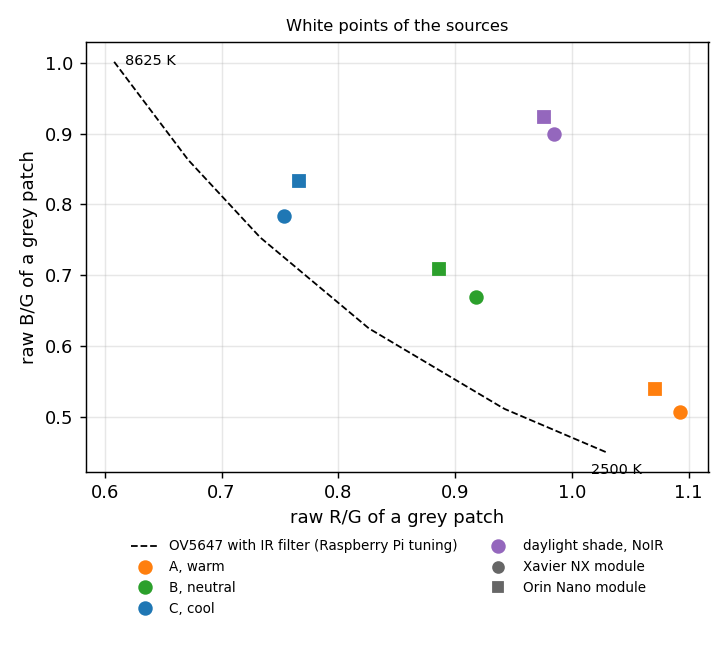
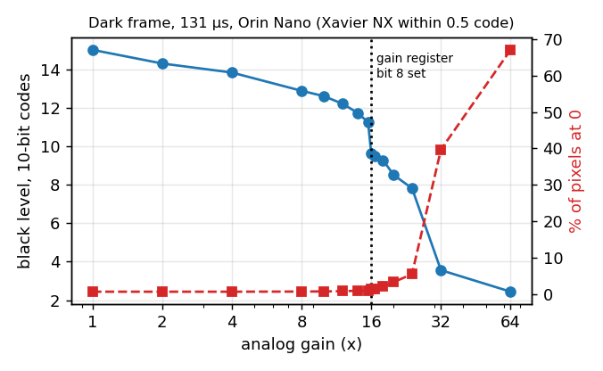
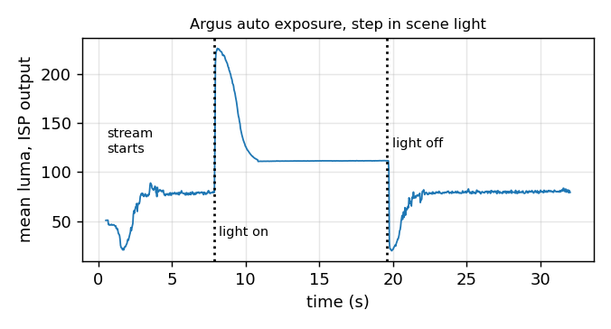

# Colour on the Jetson ISP

The two modules used here turned out to be the NoIR variant of the Pi
Camera v1, with no infrared cut filter. That came to light late, when
a black hoodie in the sun came out light grey.

This page covers what the missing filter does outdoors, what the
Jetson ISP does on top of it, and an override file measured under
artificial light, where the filter matters much less. The ISP results
are from L4T R35 on a Xavier NX through Argus; raw frames come from
V4L2 on the Xavier NX and the Orin Nano.

Little of this is publicly documented. The key names come from the
generic tuning that L4T installs as text inside `libnvscf.so`, a few
pieces from scattered forum threads, and what each key does was worked
out by measuring the images it produces.

| source | generic L4T tuning | `isp/camera_overrides_noir.isp` |
|---|---|---|
| A, warm LED | 41.7 | 17.9 |
| B, neutral LED | 37.3 | 11.3 |
| C, cool LED | 32.3 | 11.1 |
| B with a second, warm source | 39.2 | 13.1 |

Mean ΔE (CIE76) over the 18 colour patches of a ColorChecker Classic,
measured on the ISP's JPEG output. Lower is better; a difference of
2 to 3 is about where it stops being visible. Sources A, B and C
differ in spectrum, intensity and distance from the chart. The file
installs as `/var/nvidia/nvcam/settings/camera_overrides.isp`; the
commands are at its top.

## The lab

Calibrated it is not. The numbers on this page compare tunings under
the same conditions and say little about absolute colour accuracy.

## Outdoors: the infrared

Left: the ISP with its generic tuning. Middle: the first,
daylight-only override, captured with `saturation=1.5
exposurecompensation=0.3` on `nvarguscamerasrc`. Right: an iPhone, for
scale. Leaves reflect near infrared strongly, and without a filter
that light lands in the red, green and blue pixels alike, so the
sensor sees bright, colourless foliage. No colour matrix brings the
green back; it was never recorded.

The white points show the same thing in numbers. Under the LED
sources a grey patch sits near the white locus of the OV5647 with an
infrared filter (from the Raspberry Pi tuning for the same sensor); in
daylight shade it moves far off it, with red and blue both raised by
infrared.

A colour matrix fitted to the chart in daylight reaches a mean ΔE of
18 only with coefficients above 6, which amplifies noise six times
over. Held to coefficients near 1.5 it is at ΔE 38. Under the LED
sources the same fit gives 9 to 14 with coefficients below 3, and the
matrix comes out close to the one Raspberry Pi publishes for the
module with the filter. The method works; outdoors, the sensor does
not have the information.

## What the generic tuning does

L4T falls back to a tuning stored as text in `libnvscf.so`. Its white
balance is calibrated for an IMX091. On this sensor that gives a gain
of about 1.65 on red and blue, measured on the chart, and the picture
turns magenta under any light.

- **White balance.** AWB clamps its estimate to the IMX091's grey line
  (`awb[.v4].LowU`, `HighU`, `GrayLineThickness`,
  `GrayLineSoftClamp`). The gains it then applies match the white of
  that sensor's starting light, D50. Giving
  it this sensor's whites in `awb.v4.FusionLights` and opening the
  clamps fixes it. The white entered is not exactly the white that
  comes out, because AWB also looks at the scene: the entries needed a
  correction of about R x1.08, B x1.12, found by measuring two settings
  and interpolating.
- **Colour matrix.** The ISP behaves as if it normalises each row of
  `colorCorrection.set[i].ccMatrix` to sum to one, so the matrix cannot
  correct white balance; a matrix that only scales red and blue has
  almost no effect. Each row is an input channel, the transpose of
  libcamera's layout.
- **Which matrix.** The ISP picks and blends matrices by its own
  estimate of colour temperature, made the IMX091's way, so its number
  has little to do with the source's. Blending looks linear in mired:
  two pairs of marker matrices (2500/9000 K and 2500/5000 K) agree with
  each other only under that assumption, and put source B near
  4600 K. A real matrix labelled 4640 K then did worse than expected,
  so the markers probably bias the reading they are meant to take.
  Matrix labels were set by measuring ΔE instead; moving them by 500
  to 1000 K changed the result by 0.2 to 1.5.
- **Validation.** Argus checks the override file. A rejected line
  stops the camera and `journalctl -u nvargus-daemon` names it. Writing
  one key several times with different values in a single file shows
  which values are accepted: `HighU` up to 4, `GrayLineThickness` up to
  1, `awb.v4.Method` 0 to 3. A matrix coefficient of 4.04 was rejected
  and 3.74 accepted. Matrices labelled 2000 and 12000 K stopped the
  camera with no log line; 2500 and 9000 K work. A
  matrix set written in any other syntax than
  `colorCorrection.set[i].cct` and `.ccMatrix[0..3]` is not parsed and
  turns the image black. After any change, delete `nvcam_cache_*.bin`
  next to the override and restart `nvargus-daemon`.

## Method

Raw frames through V4L2 at 2592x1944, gain 1x, exposure set so the
white patch stays below 85% of full scale. The 24 patch centres are
sampled 40 by 40 pixels in each Bayer plane, away from the chart's
scratches; black is 16 of 1023.

White balance comes from the three middle grey patches (N8, N6.5,
N5):

$$ g_c = \frac{\sum G}{\sum c}, \quad c \in \{R, G, B\} $$

The colour matrix maps white-balanced camera RGB to linear sRGB. Its
rows sum to one so that grey stays grey, which leaves six free
coefficients. It minimises the mean CIE76 ΔE over the 18 colour
patches against the published sRGB values of the chart, with a
penalty that keeps it near identity:

$$ M^* = \arg\min_M \frac{1}{18} \sum_{k=1}^{18} \Delta E_{76}\big(\mathrm{Lab}(M\,\mathbf{x}_k),\ \mathrm{Lab}_k\big) + \lambda \lVert M - I \rVert_F^2 $$

with λ = 0.1 indoors and 3 for daylight. The Xavier NX and the Orin
Nano modules are fitted together. A saturation factor s is then
folded in, preserving luma:

$$ M_s = \big((1-s)\,\mathbf{1}\mathbf{y}^\top + s I\big) M, \quad \mathbf{y} = (0.2126, 0.7152, 0.0722), \ s = 1.2 $$

and the result is written transposed into `ccMatrix`. A factor of 1.3
did worse on the ISP output, and 1.4 pushes a coefficient past the
limit of 4.

Light adds linearly in raw, so a source can be measured while another
one is on: a frame with both, minus a frame with the first alone, is
the chart under the second alone. One extra source was measured this
way; its white point came out within 0.03 of source A's.

The ISP is scored on its own output: JPEG, sRGB decoded to linear,
scaled so that N6.5 matches the reference, converted to Lab, ΔE per
patch. This includes the ISP's tone curve and sharpening, which a raw
fit does not see, so it reads higher than the fit.

## Other measurements

The sensor's black level falls with analog gain: about 15 of 1023 up
to 8x, 11 at 15.5x, a step down at 16x, and about 2 at 64x with two
thirds of the pixels clipped at zero. Both boards agree. Changing the
BLC registers (0x4000 to 0x4005) did not hold it. Capping analog gain
at 15.9x and letting the ISP add digital gain removes the clipping but
gives a worse signal to noise ratio in low light, so no cap is
applied.

Argus auto exposure with this driver settles within 5% in 2.3 to 2.6
s after a step in either direction, without oscillation. In steady
light the frame mean varies 0.1% from frame to frame.

- Exposure is linear from 1 to 30 ms.
- The one mains-powered ceiling light tested shows 100 Hz banding at
  short exposures, 1 to 2% deep.
- With the override, luma noise on the grey patches is unchanged; red
  and blue noise rise 15 to 40%, the cost of the matrix.

## Limits

- A grey keeps a slight green tint on the output (a\* about -5 to -7
  under B and C). Moving a source's white in the file barely changes
  it.
- Source A, the warmest, does worst: the blue channel is weak under
  it, and the raw fit itself only reaches ΔE 14.
- The daylight entry was measured once, in shade, and was tested only
  in an earlier, daylight-only file; outdoors this file is untested.
- The tone curve and the lack of lens shading correction are the
  generic tuning's. Corners are darker and the residual ΔE includes
  that.
- The ColorChecker has seen better days.
- Measured on L4T R35. The Nano (R32) uses the same mechanism and is
  untested. On the Orin (JetPack 7) Argus does not run for this sensor
  at all, so there is no ISP to tune there; its raw frames were used
  in the fits.
- A module with an infrared cut filter should do markedly better
  outdoors with the same procedure.
