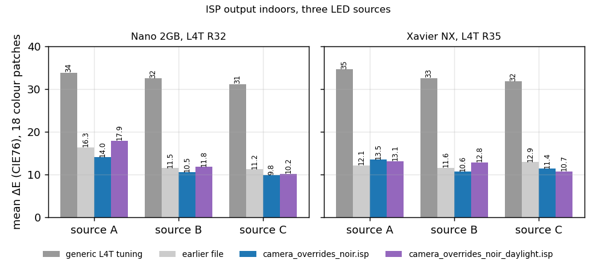
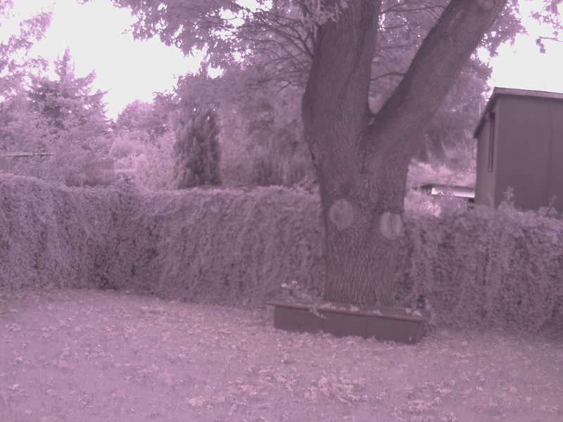
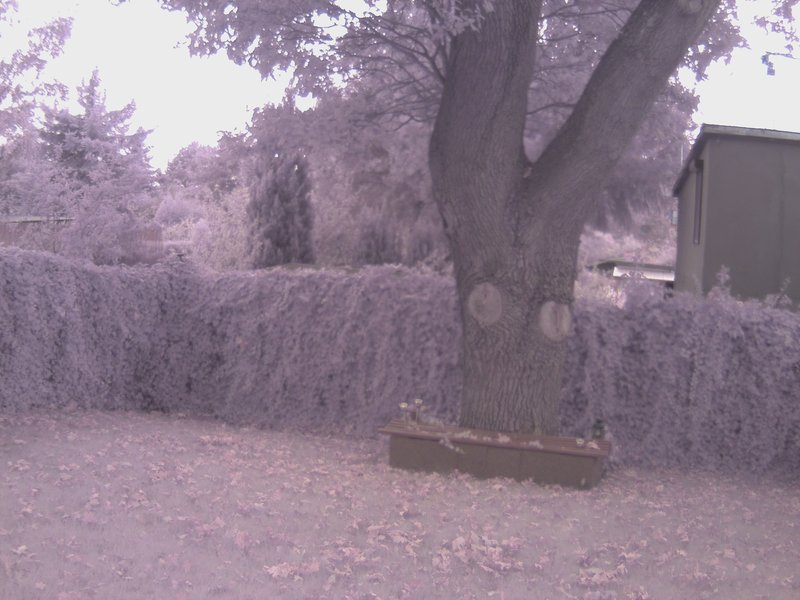
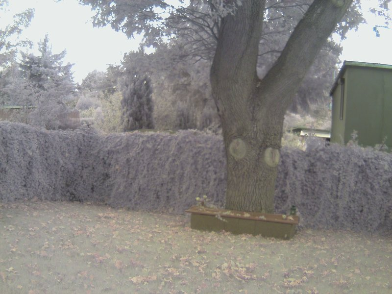
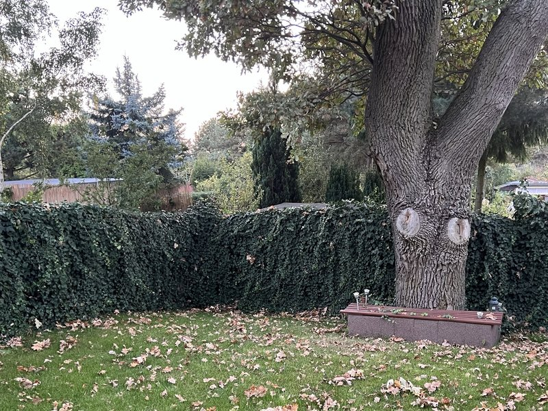
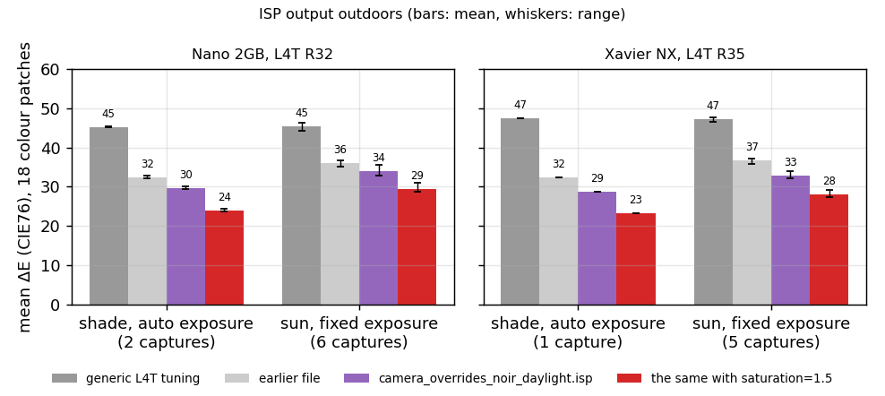

# Colour on the Jetson ISP

The two modules used here turned out to be the NoIR variant of the Pi
Camera v1, with no infrared cut filter. That came to light late, when
a black hoodie in the sun came out light grey.

This page covers two override files for the Jetson ISP and how they
were measured. `isp/camera_overrides_noir.isp` is for artificial
light. `isp/camera_overrides_noir_daylight.isp` is for outdoor scenes,
where the missing filter and a few habits of the ISP need different
settings. Both were checked through Argus on a Nano 2GB (L4T R32) and a
Xavier NX (L4T R35). Raw frames came from V4L2 on the Nano, the Xavier
NX and the Orin Nano.

Little of this is publicly documented. The key names come from the
generic tuning that L4T installs as text inside `libnvscf.so`, and a
few details from forum threads. The effect of each key was found by
measuring the images it produces.

| generic L4T tuning | `camera_overrides_noir.isp` |
|---|---|
|  |  |

Xavier NX, L4T R35, source B.

| source | board | generic | earlier file | `camera_overrides_noir.isp` | `..._daylight.isp` |
|---|---|---|---|---|---|
| A | Nano | 33.8 | 16.3 | 14.0 | 17.9 |
| B | Nano | 32.5 | 11.5 | 10.5 | 11.8 |
| C | Nano | 31.2 | 11.2 | 9.8 | 10.2 |
| A | Xavier NX | 34.6 | 12.1 | 13.5 | 13.1 |
| B | Xavier NX | 32.6 | 11.6 | 10.6 | 12.8 |
| C | Xavier NX | 31.8 | 12.9 | 11.4 | 10.7 |

The numbers are the mean ΔE (CIE76) over the 18 colour patches of a
ColorChecker Classic, measured on the ISP's JPEG output. Lower is
better. A difference of 2 to 3 is about the limit of what the eye
sees. Sources A, B and C differ in spectrum, intensity and distance
from the chart. The earlier file is the first version of
`camera_overrides_noir.isp`, measured while the sensor's own white
balance was still on (see below).

## The lab

Calibrated it is not. The numbers on this page compare tunings under
the same conditions and say little about absolute colour accuracy.

## The sensor's own white balance

The OV5647 has an automatic white balance of its own, enabled by
register 0x5001 after reset. The first version of the driver never
wrote that register, so the sensor scaled red and blue in the "raw"
output, and the scaling depended on what it had seen before. Under one
source the blue to green ratio of the same scene read 0.65 with it off
and 0.86 with it on. Mainline turns it off, and this driver now does
too.

The earlier override file was measured with it on. Its white points
needed an empirical correction (R x1.08, B x1.12) and a hand-adjusted
entry for source C to give a neutral grey. With the sensor's balance
off, all white points were measured again on raw frames, and neither
correction is needed.

The white points follow the module and not the board. Module 88110a5d34
gave the same values on the Orin and on the Nano, within 0.01, and
module e80cca6142 repeated on the Xavier NX within 0.01. The two
modules differ from each other by 3 to 5%. Module e80cca6142 has a
higher R/G and a lower B/G under every source. The override files use
the mean of the two.

## Outdoors: the infrared

| generic L4T tuning | earlier file |
|---|---|
|  |  |
| **`camera_overrides_noir_daylight.isp`, `saturation=1.5`** | **iPhone, a day earlier, for scale** |
|  |  |

Xavier NX, L4T R35, 2592x1944. Leaves reflect near infrared strongly.
Without a filter that light reaches the red, green and blue pixels
alike, and the sensor sees bright, pale foliage. A colour matrix
cannot restore the green, because the sensor never recorded it. The
override removes the magenta cast. The hedge stays grey with a violet
tint.

In the white point plot the LED sources sit near the white locus of
the OV5647 with an infrared filter, taken from the Raspberry Pi tuning
for the same sensor. Daylight lies far from it, at R/G 0.99 to 1.05
and B/G 0.80 to 0.83 in shade, and at R/G 1.09 to 1.11 and B/G 0.76
to 0.78 in sun, with red and blue raised by infrared. A matrix fitted
to raw daylight frames reaches a mean ΔE of 18 to 22 in shade and 23
to 28 in sun. Under the LED sources the same fit reaches 9 to 14.

The outdoor session ran for about an hour of changing sun and cloud.
Every four minutes both boards captured the chart in raw at five
exposures and through the ISP with each candidate file.

| board | conditions | generic | earlier file | `..._daylight.isp` | with `saturation=1.5` |
|---|---|---|---|---|---|
| Nano | shade, auto exposure (2) | 45.2 | 32.4 | 29.8 | 24.0 |
| Nano | sun, fixed exposure (6) | 45.5 | 36.1 | 33.9 | 29.5 |
| Xavier NX | shade, auto exposure (1) | 47.4 | 32.5 | 28.8 | 23.2 |
| Xavier NX | sun, fixed exposure (5) | 47.2 | 36.6 | 32.8 | 28.0 |

The numbers in brackets are the number of captures averaged. Four
things in the ISP limited the outdoor result, and three of them can be
changed.

- **Lux prior.** The white balance fuses several estimates
  (`awb.v4.FusionUseGray`, `FusionUseGprob`, `FusionUseLux`,
  `FusionUseHistory`). The lux part has its thresholds and weights
  (`LuxThresholds`, `LuxProbCoffs`) tuned for another sensor. With a
  correct daylight entry for this sensor and the lux part on, the greys
  outdoors came out magenta and blue, at a\* +10 and b\* -13. With
  `awb.v4.FusionUseLux = FALSE` they
  came out at a\* -2.5 and b\* +3.9. Indoors the change made no
  difference, so both files carry it.
- **Auto exposure on a sunlit chart.** Argus meters the whole frame.
  With the chart in sun and the garden around it in shade, most
  patches clipped to white, and every file scored 42 to 48. The sun
  rows of the table therefore use a fixed exposure (0.3 ms, gain 1x),
  set through `nvarguscamerasrc` properties.
- **Black level.** The generic tuning has
  `opticalBlack.float.manualBias*` at 0, so the ISP does not subtract
  the sensor's black level. Subtracting 15 of 1023 improved the outdoor
  score by about 1 and brought the black patch closer to its
  reference. Indoors the result was mixed, from 1.1 better to 1.6
  worse, and dark patches changed colour. On the Xavier NX under source
  B the black patch went from {60, 63, 73} to {50, 59, 48} in 8-bit
  RGB, as if the bias were subtracted after white balance. That part
  is an inference. In dim light the sensor's black level falls with
  gain in the binned modes (see Other measurements), and the same
  subtraction crushed the whole grey row of the chart to 16 of 255. The
  daylight file subtracts it, the indoor file does not.
- **Colour temperature.** The ISP picks colour matrices by its own
  estimate of colour temperature. With infrared raising red, it put
  daylight at 3300 to 5700 K, sun and shade alike. The LED sources
  landed at 3400 to 3700 K (A), 4300 to 4600 K (B) and 4500 to 5600 K
  (C). Daylight needs a much stronger matrix than the LEDs, and the ISP
  cannot tell the two apart. A daylight entry also pulled the white
  estimate under the warm LED source. On the Nano under source A it
  raised ΔE from 14.0 to 17.4. This overlap is the reason for two
  files.

What the daylight file cannot recover, Argus saturation partly does.
The `saturation` property of `nvarguscamerasrc` defaults to 1.0, and
the ISP changes nothing by itself at that value. At 1.5 the outdoor ΔE
fell by 4 to 6 in shade and in sun. At 2.0 it fell further in shade,
to 20.7 to 21.8. That value was not measured in sun. Indoors the files
already give about the right saturation, and a higher value would
overshoot.

## What the generic tuning does

L4T falls back to a tuning stored as text in `libnvscf.so`. Its white
balance is calibrated for an IMX091. On this sensor it applies a gain
of about 1.65 to red and blue, measured on the chart, and the picture
turns magenta under any light.

- **White balance.** AWB clamps its estimate to the IMX091's grey line
  (`awb[.v4].LowU`, `HighU`, `GrayLineThickness`,
  `GrayLineSoftClamp`). Entering this sensor's whites in
  `awb.v4.FusionLights` and opening the clamps fixes the cast. The
  output white does not equal an entered white, because AWB also
  looks at the scene. Under source C, with an identity matrix, the
  grey came out with red 11% low.
- **Colour matrix.** The ISP behaves as if it normalised each row of
  `colorCorrection.set[i].ccMatrix` to sum to one. The matrix therefore
  cannot correct white balance, and a matrix that only scales red and
  blue has almost no effect. Each row is an input channel, the
  transpose of the libcamera layout. A matrix also amplifies the error
  the white balance leaves. With diagonal terms near 1.8, the grey that
  came out 11% low in red with an identity matrix came out 26% low with
  the fitted one.
- **Matrix choice.** The ISP blends matrices by its colour temperature
  estimate, linearly in mired as far as two pairs of marker matrices
  show. The estimate follows the IMX091's grey line, so the number has
  little to do with the source. `tools/isp/cct-markers.py` measures it.
- **Validation.** Argus checks the override file. A rejected line stops
  the camera, and `journalctl -u nvargus-daemon` names the line. A file
  with one key written several times, each with a different value,
  shows which values are accepted. `HighU` accepts up to 4,
  `GrayLineThickness` up to 1, and `awb.v4.Method` 0 to 3. A matrix
  coefficient of 4.04 was rejected and 3.74 accepted. Matrices labelled
  2000 and 12000 K stopped the camera with no log line. 2500 and 9000 K
  work. A matrix set in any syntax other than
  `colorCorrection.set[i].cct` and `.ccMatrix[0..3]` is ignored and
  turns the image black. After any change, delete `nvcam_cache_*.bin`
  next to the override and restart `nvargus-daemon`.
- **Tone mapping.** Turning off the global and the local tone mapping
  (`tc.v3.gtm.enable`, `tc.v3.ltm.enable`) changed the outdoor score by
  less than 1.

## Method

The raw frames are 2592x1944, taken through V4L2 at gain 1x, with the
exposure set to keep the white patch below 85% of full scale. Each of
the 24 patches is sampled over 40 by 40 pixels in each Bayer plane at
its centre, away from the chart's scratches. Black is 16 of 1023.

White balance comes from the three middle grey patches (N8, N6.5,
N5):

$$ g_c = \frac{\sum G}{\sum c}, \quad c \in \{R, G, B\} $$

The colour matrix maps white-balanced camera RGB to linear sRGB. Its
rows sum to one so that grey stays grey. That leaves six free
coefficients. The fit minimises the mean CIE76 ΔE over the 18 colour
patches against the chart's published sRGB values, with a penalty
that keeps the matrix near identity:

$$ M^* = \arg\min_M \frac{1}{18} \sum_{k=1}^{18} \Delta E_{76}\big(\mathrm{Lab}(M\,\mathbf{x}_k),\ \mathrm{Lab}_k\big) + \lambda \lVert M - I \rVert_F^2 $$

λ is 0.1 for the LED sources and 0.3 for daylight. Lower values give
daylight coefficients near 4, the limit Argus accepts. The two camera
modules are fitted together for the LED sources, and the daylight
matrix comes from one module in shade. For the LED sources a
saturation factor s is then folded in with luma preserved:

$$ M_s = \big((1-s)\,\mathbf{1}\mathbf{y}^\top + s I\big) M, \quad \mathbf{y} = (0.2126, 0.7152, 0.0722), \ s = 1.2 $$

The result goes into `ccMatrix` transposed.

The ISP is scored on its own output. The JPEG is decoded from sRGB to
linear, scaled so that N6.5 matches the reference and converted to
Lab, and ΔE is computed per patch. This score includes the ISP's tone
curve and sharpening. The raw fit does not see them, so the ISP score
reads higher than the fit.

## From the measurements to the file

Nothing is written into a binary. `libnvscf.so` is only read: `strings`
on it lists the generic tuning, with the key names and their defaults.
The override is a plain text file with the same `key = value;` syntax.
Argus reads it at start and applies it on top of the generic tuning.

White points. For each source the fit gives the raw ratios R/G and B/G
of a grey patch, here the mean of the two modules. They are scaled so
that the largest of R, G and B is 900, and go into
`awb.v4.FusionLights[i] = {R, Gr, Gb, B}` with Gr equal to Gb. Source B
as an example:

    raw grey        R/G 0.900  B/G 0.662
    scaled to 900   {810, 900, 900, 596}

The generic tuning names its eight light slots after illuminants (CIE
A, FL11, 6500 K, 2400 K, 5000 K, 8000 K, FL2, OSRAM). Source A takes
slots 0 and 3, source B 1, 4 and 6, source C 2 and 7. Slot 5 holds
source C in the indoor file and daylight in the daylight file.

Clamps. `LowU` 0.05, `HighU` 4.0, `GrayLineThickness` 1.0 and
`NumGrayLineSoftClampPoints` 0, written for both `awb.` and `awb.v4.`.
4.0 and 1.0 are the largest values Argus accepts. Both files also set
`awb.v4.FusionUseLux = FALSE`, and the daylight file sets
`opticalBlack.float.manualBias*` to 0.0146.

Colour matrices. Each matrix fills
`colorCorrection.set[i].ccMatrix[0..2]` transposed, and `ccMatrix[3]`
is the identity row `{0, 0, 0, 1}`. In the indoor file the sets carry
the labels 3500 K (source A), 4500 K (B), 5500 K (C) and 8500 K (C
again, as fitted). In the daylight file they are 3500 K (A), 4230 K
(daylight), 4600 K (B) and 5500 K (C). 4230 K is where the ISP put
the shade in the first captures of the session.

Each change was checked the same way: copy the file into place,
delete `nvcam_cache_*.bin`, restart `nvargus-daemon`, check the log for
rejected lines, capture the chart through the ISP and score the JPEG.

## Reproducing

The tools are in `tools/isp/`. The Python ones need numpy and Pillow,
and `fit.py` also needs SciPy. The shell scripts run on the board.

1. List the keys of the generic tuning and their defaults.

       tools/isp/dump-defaults.sh > defaults.txt

2. Find the values Argus accepts for a key. Each argument becomes one
   line of a temporary override, and the script reports which lines
   the daemon rejects.

       sudo tools/isp/probe-keys.sh 'awb.v4.HighU = 4.0;' 'awb.v4.HighU = 5.0;'

3. Capture the chart in raw under each light source, at several
   exposures. After an Argus pipeline, add `REBIND=1` and run as root.

       tools/isp/capture-raw.sh chart-B /dev/video0 10000 20000 40000

4. Fit. The corners are the centres of the dark skin, bluish green,
   white and black patches in full-resolution pixels. `--preview` draws
   the sampled squares, to check them. Several `--capture` arguments,
   for example one per camera module, give one joint matrix.

       tools/isp/fit.py --capture chart-B/e20000.bin '444,465;2274,510;348,1581;2322,1611' \
               --lambda 0.1 --out fit-B.json --preview check-B

5. Describe the sources in a JSON file like those in `isp/` (white
   points and matrices from the fits, slots, labels, saturation, and
   optionally `lux_prior` and `black`) and build the override from it.

       tools/isp/make-override.py my.json > my.isp

6. Capture the chart through the ISP with and without the override and
   score both. Mode 2 is half the sensor resolution, so full-resolution
   corners take `--scale 0.5`. `ARGUS` passes properties to
   `nvarguscamerasrc`, for example a fixed exposure for a sunlit chart.

       sudo tools/isp/capture-isp.sh none generic.jpg
       sudo tools/isp/capture-isp.sh my.isp tuned.jpg
       sudo ARGUS='exposuretimerange="300000 300000" gainrange="1 1"' \
               tools/isp/capture-isp.sh my.isp tuned-fixed.jpg
       tools/isp/score.py --scale 0.5 --corners '...' generic.jpg tuned.jpg

   `capture-isp.sh` puts back the previously installed override when it
   exits. If the board loses power during a capture, the test file
   stays installed.

7. To see which colour temperature the ISP assigns to a scene, use
   `tools/isp/cct-markers.py`. Its help text explains the procedure.

Both files in `isp/` are generated by step 5 from the JSON files next
to them, and CI checks that each pair matches.

## Other measurements

In the binned modes the sensor's black level falls with analog gain.
It is about 15 of 1023 up to 8x and 11 at 15.5x, steps down at 16x,
and reaches about 2 at 64x with two thirds of the pixels clipped at
zero. Both boards agree. At full resolution it stays near 16 up to
32x, taken as the zero-exposure intercept of dark frames at four
exposures. Changing the BLC registers (0x4000 to 0x4005) did not hold it.
A cap on analog gain at 15.9x, with digital gain from the ISP above
that, removes the clipping but lowers the signal to noise ratio in low
light. The driver applies no cap.

With this driver, Argus auto exposure settles within 5% in 2.3 to
2.6 s after a step in either direction, without oscillation. In steady
light the frame mean varies by 0.1% from frame to frame.

- Exposure is linear from 1 to 30 ms.
- The one mains-powered ceiling light tested shows 100 Hz banding at
  short exposures, 1 to 2% deep.
- With the override, luma noise on the grey patches is unchanged. Red
  and blue noise rise by 15 to 40%, the cost of the matrix.

## Limits

- The two modules differ by 3 to 5% in white point, and the files use
  their mean. With the indoor file the greys of module 88110a5d34 stay
  within 3 of neutral in a\* and b\*. Module e80cca6142 keeps a tint,
  b\* +9 under source A and a\* -7 under source C. On that module under
  source A the earlier file scored better, 12.1 against 13.5.
- Source A, the warmest, does worst. Its blue channel is weak, and the
  raw fit itself only reaches ΔE 12 to 16.
- Outdoors the infrared sets the limit. The best result, 23 to 30 with
  `saturation=1.5`, is still far from the indoor numbers, and foliage
  keeps its violet grey.
- The daylight file is for daylight only. In dim light it crushes the
  shadows, and indoors it does worse than the indoor file. The indoor
  file was not tested in daylight.
- The tone curve and the missing lens shading correction come from the
  generic tuning. The corners are darker, outdoors the image is flat,
  and the remaining ΔE includes that.
- The ColorChecker has seen better days.
- On the Orin (JetPack 7) Argus does not run for this sensor, so there
  is no ISP to tune. Its raw frames went into the fits.
- A module with an infrared cut filter should do much better outdoors
  with the same procedure.
